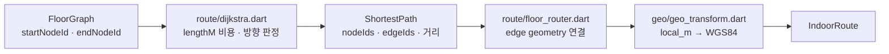

# `lib/domain` — 온디바이스 경로·좌표 계산

Flutter 화면이나 HTTP를 모르는 계산 계층이다. 백엔드가 제공한 그래프를 탐색해 경로를
만들고, 건물 로컬 좌표와 지도 좌표 사이를 변환한다.

## 여섯 갈래로 나눠 둔다

가르는 기준은 파일 수가 아니라 **고치는 이유**다. 경로를 만드는 코드는 목적지가
바뀔 때 돌고, 따라가는 코드는 걸음이 들어올 때 돈다 — 한 폴더에 두면 진행률 버그를
고치려는 사람이 다익스트라까지 읽는다.

| 폴더 | 무엇 | 대표 파일 |
|---|---|---|
| [`route/`](route) | **경로를 만든다** | `dijkstra.dart`(최단 경로) · `floor_router.dart`(경로점 변환) · `multi_floor_router.dart`(층별 분할) · `route_endpoint_fill.dart`(끝을 출입구에 맞춤) · `transit_walk_fill.dart`(앞뒤 도보 채움) · `building_entrances.dart`(어느 문으로 들어갈지) |
| [`guidance/`](guidance) | **만든 경로를 따라간다** | `route_progress.dart`(진행·남은거리·이탈) · `route_guidance.dart`(다음 행동 한 줄, 경로선 분할, 도착 자동 종료) · `route_checkpoint.dart` · `corridor_tracking.dart`(복도 보정의 어휘) · `escalator_ride.dart`(탑승~하차 마커 활강) · `guidance_chrome.dart`(안내 중 chrome 접기) |
| [`store/`](store) | **매장을 고른다** | `nearest_store.dart`(같은 이름 중 최근접) · `nearby_stores.dart`(이 매장 기준 근처) · `store_hours.dart`(지금 영업 중인가) · `indoor_store_lookup.dart`(POI 브랜드로 재조회) · `reach_label.dart`(몇 m · 도보 몇 분) |
| [`search/`](search) | **질의를 후보로 바꾼다** | `store_suggestions.dart`(자동완성·오타 교정) · `hangul.dart`(자모 분해) · `search_result_order.dart`(거리순 정렬) · `name_siblings.dart`(형제 매장) · `reason_text.dart`(추천 이유 다듬기) |
| [`category/`](category) | **분류와 표시 문구** | `category_taxonomy.dart` · `category_label_order.dart` · `subcategory_label.dart` |
| [`geo/`](geo) | **좌표계** | `geo_transform.dart`(local_m ↔ WGS84 affine, PDR 축 피팅) · `floor_label.dart`(층 라벨 순위) · `distance_format.dart`(거리 문구의 단일 출처, 1 km부터 km) |

## 단일 층 경로 계산

현재 `BuildingRepository.getShortestRoute` 계약은 층 하나를 받는다. 층 간 길찾기는
건물 전체 그래프, 수직 전이 간선, 층별 지도 조립을 함께 연결해야 하며 단일 층 함수에
임의로 섞지 않는다. 설계는
[`../../../docs/navigate/client-handoff.md`](../../../docs/navigate/client-handoff.md)를 참고한다.

## 경로 기준 위치 해석 — 단방향

PDR 위치 추정은 층 그래프 전체를 상대로 하고 경로를 모른다. `guidance/route_progress.dart`는
그 결과를 **소비만** 한다.

역방향(경로 간선을 우선해 위치를 끌어당기기)을 허용하면, 사용자가 실제로 다른 길로
갔을 때도 화면 위치는 경로에 붙어 있어 앱이 조용히 거짓 안내를 계속한다. 잘못된 이탈
판정은 사용자가 알아채지만 조용히 틀린 위치는 아무도 알아채지 못하므로, 이 방향
제약은 성능 문제와 무관하게 유지한다.

## 의존 경계

- **`domain`은 `models`만 import한다.** 화면·위젯·리포지토리·지도·features·HTTP를
  전부 보지 않는다. 이 방향은
  [계층 검사](../../test/lib_layer_direction_test.dart)가 지킨다.
- `geo/geo_transform.dart`는 PDR 좌표 계약(`PdrToFloorAxes`)을 **정의**하지만 센서
  세션은 소유하지 않는다. features 쪽이 이 타입을 가져다 쓴다.
- 한때 거꾸로 가는 화살표가 넷 있었다. 하나는 **주석에 건 대괄호 링크** 때문에
  생겼다 — 대괄호는 import를 끌고 오므로, 위층을 가리킬 때는 경로를 글자로만 적는다.

## 실패 지점

- 시작/도착 node가 없거나 연결되지 않으면 경로가 없다. 가까운 node를 임의 선택하는 정책은 호출자가 정한다.
- edge 방향과 geometry 점 순서가 반대일 수 있으므로 이동 방향에 맞게 뒤집어야 한다.
- edge `lengthM`이 음수·비정상이면 Dijkstra 전제가 깨진다.
- 좌표 대응점이 부족하거나 거의 일직선이면 affine 피팅이 불안정하다.
- 층별 그래프만으로 수직 전이 edge를 찾을 수 없다.
- 경로 이탈을 좌표 거리로 판정하면 경로와 나란한 옆 복도에 잘못 붙었을 때도 "경로 위"로 보인다. 판정은 간선 동일성으로만 한다.
- 진행률을 매번 전역 최소 투영으로 구하면 ㄷ자 경로에서 마주보는 구간이 가까워 진행거리가 순간이동한다. 이전 진행거리 기준 지역 탐색이 필요하다.
- 이전 진행거리 근처 후보라도 실제 걸음으로 설명할 수 없는 폭으로 튀면 다음 행동과 파란선이 건너뛴다. 마지막 채택 이후 걸음 수로 허용 이동량을 제한해야 한다.
- 경로·층 세그먼트가 바뀔 때 이전 진행거리를 기준으로 남겨두면 매 걸음 재획득이 켜진다. 호출자가 기준점을 초기화해야 한다.
- 진행률이 없을 때의 안내는 남은거리를 폴리라인 전체 길이로 대신 계산한다. 이 상태의 "도착"은 걸어서 도착한 것이 아니라 경로가 짧다는 뜻이므로, 자동 종료 판단에 그대로 쓰면 바로 옆 매장 경로가 그려지자마자 사라진다.

## 검증 기준

- 시작과 도착이 같을 때 거리 0의 경로가 나온다.
- 단방향 edge는 역방향으로 통과하지 못한다.
- 선택된 edge 길이 합과 `IndoorRoute.distanceMeters`가 일치한다.
- 경로점의 첫·끝이 선택 node와 일치하고 WGS84 순서가 뒤바뀌지 않는다.
- 경로를 따라 걸으면 진행거리는 단조 증가하고 남은거리는 단조 감소하며, 두 값의 합은 폴리라인 전체 길이다.
- 이탈거리가 작아도 현재 간선이 경로에 없으면 경로 위로 판정하지 않는다.
- 걸음 없는 큰 진행거리 점프는 표시에서 보류하고, 누적 걸음으로 설명되는 이동은 반영한다.
  ([`../../test/domain/guidance/route_progress_test.dart`](../../test/domain/guidance/route_progress_test.dart))
- 측정된 진행률로 목적지에 도착했을 때만 안내 자동 종료를 예약하고, 도착 상태에서 벗어나면 취소한다. 환승 지점·역주행·진행률 없는 짧은 경로는 종료하지 않는다.
  ([`../../test/domain/guidance/route_arrival_auto_clear_test.dart`](../../test/domain/guidance/route_arrival_auto_clear_test.dart))

---

> **다음 읽기:** [`lib/repositories` — 데이터 접근 경계](../repositories/README.md)
