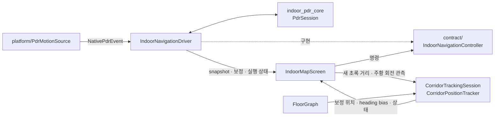

# `indoor_navigation/application` — PDR 세션과 맵 매칭

플랫폼 센서 이벤트를 PDR 코어에 전달해 앱 범위 세션을 운영하고, 원본 PDR과 분리된
제품 위치를 층 그래프 제약으로 지속 보정한다.

## 구성 파일

| 파일 | 역할 | 주요 타입 |
|---|---|---|
| [`indoor_navigation_controller.dart`](indoor_navigation_controller.dart) | 센서·PDR 코어·보정·앱 lifecycle을 소유하는 headless 세션 | `IndoorNavigationDriver` |
| [`floor_map_matcher.dart`](floor_map_matcher.dart) | PDR 위치·경로를 보행 가능한 `FloorGraph` edge에 맞춤 | `FloorMapMatcher`, `MapMatchedFloorPoint`, `MapMatchState` |
| [`corridor_position_tracker.dart`](corridor_position_tracker.dart) | 빔 전진·1등 선출·publish. 아래 `corridor/` 넷을 조립한다 | `CorridorPositionTracker`, `CorridorTrackingState` |
| [`corridor/corridor_network.dart`](corridor/corridor_network.dart) | 그래프 질의와 방위 계산 — 어느 간선이 후보이고 어디에 투영되는가 | `CorridorNetwork`, `CorridorNode`, `CorridorEdge`, `EdgeProjection` |
| [`corridor/corridor_hypothesis.dart`](corridor/corridor_hypothesis.dart) | 가설 하나의 비용·감쇠·전이 | `Hypothesis` |
| [`corridor/corridor_observation.dart`](corridor/corridor_observation.dart) | 호출자와 주고받는 값 | `CorridorObservation`, `CorridorTrackingResult`, `TimedPreviewStep` |
| [`corridor/corridor_tracker_config.dart`](corridor/corridor_tracker_config.dart) | 튜닝값과 실측 근거 | `CorridorTrackerConfig` |
| [`corridor_tracking_session.dart`](corridor_tracking_session.dart) | snapshot 누적값에서 새 관측만 tracker에 전달 | `CorridorTrackingSession` |
| [`guidance_trail_session.dart`](guidance_trail_session.dart) | 재탐색과 독립적으로 길안내 시작 이후 실제 보행 궤적을 누적 | `GuidanceTrailSession` |
| [`escalator_transition_detector.dart`](escalator_transition_detector.dart) | 기압 변화 + 에스컬레이터 노드 근접으로 층 이동 판정. 아래 둘을 `export`한다 | `EscalatorTransitionDetector` |
| [`escalator_detector_config.dart`](escalator_detector_config.dart) | 임계값 34개와 실측 근거 | `EscalatorDetectorConfig` |
| [`escalator_detector_events.dart`](escalator_detector_events.dart) | 바깥으로 내보내는 값 | `EscalatorPhase`, `EscalatorPhaseChange`, `EscalatorTransition`, `EscalatorDetectionEvent` |
| [`escalator_node_naming.dart`](escalator_node_naming.dart) | 에스컬레이터 노드 이름에서 탑승/도착과 상대 층을 파싱 | `EscalatorNodeName`, `EscalatorDirection`, `EscalatorNodeRole` |
| [`indoor_location_estimate.dart`](indoor_location_estimate.dart) | GPS 기반 절대 추정점을 PDR과 별개로 보존·검증(아래 "GPS 추정점과 PDR의 결합") | `IndoorLocationEstimate`, `IndoorLocationEstimateController` |

## 연관 관계

## `IndoorNavigationDriver`

- `startGuidance`가 센서 구독과 새 pedometer 세션을 시작한다.
- native 이벤트는 heading → acceleration peak → pedometer 순으로 `PdrSession`에 전달한다.
- `confirmAnchorByPin`과 `confirmAnchorByFloorDirection`이 PDR 좌표를 층 `local_m`에 고정한다.
- 앱 background/foreground에서는 세션을 폐기하지 않고 pause/resume한다. 이때는 native
  센서 구독도 함께 멈춘다.
- `pauseStepTracking`/`resumeStepTracking`은 **센서를 끄지 않고** 걸음 누적만 멈춘다.
  에스컬레이터 탑승 구간을 위한 것이라, 하차 판정의 근거인 기압과 방향은 계속 흘러야 한다.
- `changeFloor`는 step counter와 anchor를 새 층 기준으로 초기화한다.
- `stopGuidance`는 마지막 pedometer 값을 확정한 뒤 센서를 멈춘다.

## `CorridorPositionTracker`

원본 경로를 수정하지 않고 제품 위치만 다음 상태로 누적한다.

| 상태 | 의미 |
|---|---|
| `straightTracking` | 1등 가설이 뚜렷하다 |
| `turnPending` | 1·2등이 다른 간선인데 점수 차가 작다 |
| `nodeConfirmed` | 이번 갱신에서 1등 가설이 노드를 넘었다 |
| `uncertain` | 모든 가설이 그래프로 설명되지 않는다(막다른 곳 등) |

상태는 동작을 바꾸지 않는다. 빔이 항상 모든 가설을 들고 있고, 이 값은 **그 빔이 지금
얼마나 갈렸는지**를 표시할 뿐이다.

- 보정 위치는 항상 현재 edge의 `distanceAlongM`으로 계산해 간선 밖 자유 적분을 금지한다.
- 일직선으로 이어진 분할 edge는 체크포인트 확정 없이 남은 걸음 거리를 연속 전달한다.
- **화면 위치는 confirmed와 별개의 optimistic beam이 들고 있다.** accel peak가 생긴 즉시
  한 번 전진하고, 나중에 확정 배치가 같은 peak를 확인하더라도 다시 전진하거나 뒤로 가지
  않는다. 같은 peak를 두 번 태우지 않는 근거는 accepted peak 시각(없으면 누적 걸음 번호)
  이다. 그래서 배치를 1걸음으로 자르든 10걸음으로 묶든 표시 위치 시계열이 같다.
  선행분을 매 프레임 재계산하던 `stabilizePreviewLeadM`은 제거했다 — 그 방식은 꼬리가
  짧아지는 배치 프레임에서 이미 보여 준 위치를 잘라냈다.
- **방향 선택이 생기는 노드 앞뒤 약 3.5m는 회전 허용 구간이다.** 사람은 코너 안쪽을 잘라
  일찍 꺾거나 지나쳐서 늦게 꺾는데, 노드 통과를 기다렸다 후보를 열면 그 사이 걸음이 전부
  직진 가설에만 쌓여 마커가 코너에 붙는다. 이 구간에서는 해당 노드에 **실제로 연결된**
  간선만 후보로 열고, 관측 방향이 그쪽을 더 잘 설명할 때만 만든다. 회전 중 진행한 거리는
  창에서 빼 주므로 직각으로 꺾는 동안 창이 닫히지 않는다.
  걸음이 없는 제자리 heading 회전으로는 간선이 바뀌지 않는다(가설 전진 자체가 걸음에서만
  일어난다). 구간 안에서는 이탈 재탐색을 최대 4초 유예하되, 그 뒤에는 기존 판정으로
  돌아가 실제 이탈을 숨기지 않는다.
- 방향은 책임별로 분리한다. `PdrSnapshot.orientationHeadingDeg`는 walkOffset·복도 bias 전의
  기기 전방축이라 마커 원뿔과 카메라가 쓰고, `walkingHeadingDeg`는 걸음 적분이 쓴다.
  tracker의 `previewHeadingDeg`는 optimistic edge 접선이다. 경로 계층은 이 접선의 peak별
  traversal을 목적지 방향으로 정규화해 실제 정·역방향 이동을 판정한다. heading만 바뀌어서는
  역방향 상태가 되지 않는다.
- 간선 전환은 공유 노드에서만 가능하므로 가까운 평행 간선이나 벽 너머 간선으로 직접 점프하지 않는다.

## `EscalatorTransitionDetector` — 기압으로 층 따라가기

에스컬레이터로 층을 옮기면 층 도면·경로를 자동으로 바꾸고, 새 층의 **도착 노드**로
위치를 옮긴다. 판정 역할 분담이 이 설계의 핵심이다.

| 근거 | 역할 |
|---|---|
| 에스컬레이터 노드 근접(반경 6m·유지 60초) | 판정 **허가**만. 방향은 정하지 않는다 — 한 랜딩에 상행 탑승/도착 노드가 1.5m 거리로 붙어 있어 둘 다 반경에 들어온다 |
| 기압(baseline 대비 Δ) | 올라갔는지 내려갔는지, 실제로 움직이는 중인지 |
| 노드 이름 `{그룹}-UP(TO3F)` / `{그룹}-UP(FR2F)` | 도착 층과 도착 노드 확정 |
| 활성 다층 경로의 전이 노드 ID | 붙어 있는 레인 중 길찾기가 선택한 정확한 탑승·도착 노드 유지 |

### 상대 고도 0점(baseline)을 다시 잡는 시점

절대 고도는 쓰지 않는다(해면기압이 시간당 1~2 hPa ≈ 8~16m 움직인다). 0점을 언제 다시
잡느냐가 전부다.

- **하차 확정(`_confirm`) 한 곳에서만** 다시 잡는다. 그 순간의 평활 고도가 지금 서 있는
  층의 고도다.
- **탑승 중에는 절대 다시 잡지 않는다.** 화면은 반 층에서 목적 층으로 먼저 넘어가지만,
  호출자는 `pendingTransition`이 있는 동안 `updateContext`를 부르지 않는다. 이 규칙이
  깨지면 긴 에스컬레이터 중간에 0점이 다시 잡혀 남은 반 층이 **또 하나의 층 이동**으로
  보인다.
- **판정이 만든 층 변경에는 기압 창을 버리지 않는다.** 0점은 이미 하차 시점에 잡혔고,
  기압 창은 층 라벨과 무관한 실제 관측 이력이다. 예전에는 여기서 창까지 비워 하차 직후
  약 3초(iOS) 동안 판정이 죽었고, 내리자마자 다음 에스컬레이터를 타는 연속 환승에서
  두 번째 층이 그만큼 늦었다.
- **설명되지 않는 층 변경**(층 선택기·계단·엘리베이터)에서만 전부 버린다. 고도 관계를
  알 수 없으므로 이전 층 0점을 들고 가면 다음 판정이 기울어진 값에서 시작한다.

**확정 직후에는 새 후보를 잠근다.** 확정이 실제 하차보다 이르면 0점이 탑승 중간 높이로
잡히고, 남은 이동분이 유령 후보로 다시 열린다(2026-08-13 Samsung 실측 — "한 번 타면 두 층"
의 정체). 저속이 1초 이어져 실제로 멎었다고 확인되는 순간 그 자리 고도로 0점을 다시 잡아
잔여분을 통째로 흡수하고, 그때까지는 후보를 열지 않는다.

### 단계 분리 (`EscalatorPhase`)

배너·걸음 pause·층 지도 전환·하차 재개는 **서로 다른 근거와 시점**을 쓴다. 예전에는 넷이
모두 `|Δ| ≥ 1.8m` 한 지점에서 동시에 일어나서, 배너는 반 층 올라간 뒤에 뜨고 지도는 아직
타는 중에 바뀌었다.

| 단계 | 근거 | 하는 일 |
|---|---|---|
| `boardingDetected` | 활성 경로의 탑승점 3m 이내 + 서로 다른 걸음 갱신 2회 이상 연속 접근 | 배너를 띄우고, **안내가 지목한 탑승점이면** 마커·진행률을 그 노드에 고정한다 |
| `verticalMotionDetected` | 수직 속도 0.12 m/s가 2샘플 연속(1차, 조용함) **그리고** 안내가 지목한 에스컬레이터 / 탑승점 3m 근접 / 누적 고도 1.2m 초과 중 하나(2차) | 위치에 반영하는 걸음을 멈추고, 마커를 **반드시** 어딘가에 고정한다 |
| `midpointReached` | 후보(누적 Δ ≥ 1.2m + ramp 일관성 0.45m/2.5s + 유효 탑승/도착 노드)가 열린 뒤 **누적 Δ ≥ 2.4m**(`mapSwapDeltaM`, 반 층 부근) | 목적 층 도면·경로를 연다 |
| `landed` | 누적 Δ ≥ 2.2m + 수직 속도 감소(+걸음 — **진동 peak는 걸음이 아니다**, 즉시 확정은 적용 걸음·네이티브 걸음만) | 새 anchor 확정, 걸음 적용 재개 |

도면 교체를 후보 문턱(1.2m)에서 바로 하지 않는 이유: 2026-08-13 실측에서 승차 ~5초째에
도면이 갈려 26초 탑승 중 21초를 도착 층 도면으로 보게 됐고, "층 전환이 너무 빠르다"는
피드백을 받았다. 2.4m는 실측 층고(4.4~6.8m)의 반 층 부근이다.

### 수직 이동은 두 겹으로 잡는다

**1차는 조용하다.** 수직 속도가 같은 방향으로 2샘플 이어지면 판정기 안에서만
`isVerticalMotionObserved`가 선다 — 화면에 뜨는 것도 없고 걸음도 그대로 흐른다. 근거가 옅은
시점에 마커를 세우면 **아직 통로를 걷고 있는 사용자의 점이 먼저 멈춰 버려** 화면이 고장 난
것처럼 보인다.

**2차에서만** 걸음을 멈추고 마커를 세운다(덮개는 또 따로 — 도면이 실제로 갈리는 순간이다).
걸음 정지는 이르게 해도 손해가 없지만 — 그 구간의 발판 진동이 위치에 쌓이는 것을 막는 일이다 —
화면을 덮는 것은 이르면 지도를 못 보는 시간만 길어진다. 올라가는 길이 셋이다.

1. **안내가 지목한 에스컬레이터**(경로 접근 16m 안). "다음에 탈 것"이 정해져 있고 기압이
   실제로 오르내리면 그 둘로 이미 확정에 가깝다. 여기서 근접까지 더 기다리면 보정 위치가 늦게
   수렴하는 랜딩에서 영영 안 걸린다.
2. **탑승점 3m 근접**(`boardingApproachRadiusM`) — 안내가 지목하지 않은 에스컬레이터일 때.
   단순 허가 반경(6m)으로는 부족하다. 그건 "층을 바꿔도 되는가"의 허가일 뿐이고, 그 거리에서
   마커를 세우면 점만 저 앞 에스컬레이터에 붙어 멈춘 화면이 된다.

**연속 환승**(내리자마자 두어 걸음 옆의 다음 에스컬레이터)은 예외다. 안내가 그 사실을 알려
주면(`consecutiveTransferRouteM`) 최소 변화를 요구하지 않는다 — 걸어갈 거리가 없어 오탐 여지도
없고, 기다리면 환승마다 마커가 먼저 몇 걸음 흘러간다.

1·2번도 **속도만으로는 올라가지 않는다.** 실제로 0.5m는 움직여야 한다(`minVisibleRiseM`).
빠른 EMA는 기압 튐 하나를 0.6 m/s로 읽어서, 속도 2샘플만 요구하면 복도를 걷는 동안에도
성립한다 — 실기기에서 "걸을 때 위치가 계속 뒤로 순간이동한다"로 나타났다. 에스컬레이터
속도로 2초면 넘는 값이라 판정이 늦어지지는 않는다.

고정 지점도 지금 위치에서 **6m 넘게 떨어져 있으면 쓰지 않는다**(`clampBoardingHold`).
판정이 이르거나 틀렸을 때 먼 노드로 스냅하면, 막으려던 것(앞 매장으로 흘러감)보다 더 눈에
띄는 뒤로 순간이동이 된다.
3. **누적 고도 1.2m 초과**(`visibleVerticalDeltaM`) + 기기가 움직이는 중이라는 신호. 평활 뒤
   잔여 노이즈(±0.3m)의 네 배이면서 반 층에는 한참 못 미쳐, 계단 몇 칸으로는 안 나오고 하차
   전에 잡힌다. 이 갈래만은 **중앙값 delta와 빠른 EMA 적분 중 먼저 문턱을 넘는 쪽**을 본다 —
   중앙값은 창 절반(iOS 1069ms 간격에 3샘플이면 약 1.1초)만큼 뒤처지고, 그 1초가 곧 발판
   진동이 위치에 쌓이는 시간이다. 층 교체 판정은 되돌릴 수 없으므로 그대로 중앙값만 쓴다. 실측에서 랜딩의 보정 위치가 12m까지 어긋나 허가가 안 걸리던 사례를 이 갈래가 받는다.
   움직임 신호가 없으면 책상 위 폰의 기압 드리프트로도 화면이 덮인다.

3번으로 열렸는데 노드를 못 골랐으면 하차를 확정할 수단이 없다. 그래서 수직 이동이 멎는 즉시
(2샘플) 접는다 — 40초 타임아웃을 기다리면 내려서 걷기 시작한 사용자에게 앱이 죽은 것과 같다.
**층 교체는 어느 쪽이든 노드 허가와 `minDeltaM`을 요구한다**(되돌릴 수 없는 쪽은 근거를 그대로
둔다).

접근 단계(`boardingDetected`)의 고정은 **경로가 그 에스컬레이터를 타라고 했을 때만** 한다
(현재 층 세그먼트의 `transferModeToNext == 'escalator'` 이고 `transferFromNodeId`가 판정기가
고른 탑승 노드와 같을 때). 근처를 지나가는 것만으로 고정하면 그냥 걷는 사용자의 마커가 멈춰
선다. 반대로 수직 이동 단계(`verticalMotionDetected`)에서는 근거를 물러서며 잡아 **반드시**
고정한다 — 안내가 지목한 탑승점 → 판정기가 고른 탑승 노드 → 그 순간의 보정 위치. 기압이
실제로 움직인 뒤라 스쳐 지나감이 아니고, 여기서 고정하지 않으면 발판 진동이 걸음으로 세어져
마커가 앞 매장으로 흘러간다(걸음 pause는 비동기라 그 사이 프레임을 못 막는다). 고정 중에는
경로 진행률도 갱신하지 않는다 — 마커만 세우고 진행률을 raw 위치로 계산하면 "경로 이탈"로
읽혀 곧 층이 바뀔 자리에서 재탐색이 돈다. 푸는 조건은 판정기가 소유한다(멀어짐·타임아웃 40초).

배너를 이르게 띄우는 이유는 틀렸을 때 비용이 거의 없기 때문이다(문구가 사라질 뿐이다).
반대로 층 지도는 잘못 바꾸면 사용자가 복구 방법을 모르므로 근거를 그대로 둔다. 접근만
하고 지나가면 제한 시간 뒤 공통 cleanup으로 되돌린다.

- `midpointReached`부터 마커는 활강(아래)을 따라 흐른다. 배너 문구가 단계별로 바뀌어
  지금 무슨 일이 일어나는지 알려주고, 확정 뒤에는 잠깐 "도착" 상태로 바뀐다. 같은 사실을
  말하는 별도 토스트는 띄우지 않는다.
- **"맞나요?"라고 되묻지 않는다.** 한때 도착 배너에 `아니에요`를 붙여 층을 되돌릴 수 있게
  했는데, 걷어냈다. 기압이 일상적으로 몇 미터씩 움직이는 일이 없어서 오탐이 드물고, 되묻는
  버튼이 붙어 있는 것 자체가 매번 "이 판정을 믿어도 되나"를 사용자에게 떠넘긴다. 판정이
  틀렸다면 층 선택기로 원하는 층을 직접 고르면 되고, 그 경로도 같은 종료 처리를 지난다.
  판정기가 스스로 취소하는 경로(`cancelled`·타임아웃)는 그대로 남아 있다 — 그쪽은 사용자에게
  묻지 않고 화면이 알아서 되돌린다.
- 배너는 이 화면이 아니라 **`MapShellScreen` root Stack**이 그린다. 검색창·카테고리 줄·
  하단 바가 셸의 형제라, 지도 안에서 그리면 상단 UI가 최악 높이일 때 뒤에 깔린다.
- **덮개는 도면이 갈리는 앞뒤만 덮는다**(진입 520ms → 유지 3.5초 → 해제 700ms, 약 4.7초).
  걸음이 멈추는 순간부터 하차까지 덮어 본 적이 있는데, 그 구간은 길게는 수십 초라 화면이
  계속 막힌 것으로 읽혔다. 무엇보다 사용자는 **내리기 전에** 새 층 도면과 다음 경로를 봐
  둬야 한다 — 내려서야 처음 보면 그 자리에서 한 번 멈춰 서게 된다. 반대로 예전의 1.6초는
  너무 짧아서 덮개가 크로스페이드·마커 활강보다 먼저 걷혀 교체 과정이 그대로 보였다.
  도면 교체가 반 층 시점으로 옮겨진 뒤 "전환 연출을 좀 더 봐도 된다"는 실측 피드백으로
  유지를 2→3.5초로 늘렸다.
- 덮개 **뒤에서** 도면 크로스페이드가 돈다. 사람이 층 chip을 눌렀을 때와 같은 길이되 페이드
  만 두 배 느리다(`floorSwitchGuidedCrossfadeDuration`, 600ms). 이전 층 도면은 새 층 타일이
  실제로 도착할 때까지 남아 있어, 덮개가 걷힐 때 새 도면이 이미 자리를 잡고 있다.
- 덮개 가운데 카드의 점은 생김새만 현재 위치 마커와 같고(`kLocationMarkerCoreRadiusPx`
  등 같은 상수), **자체 시계로 한 번 완주하는 상징**이다. 실제 탑승 진행률을 얹어 봤는데
  (2026-08-13), 남은 탑승 10초 이상에 걸친 진행이 덮개가 보이는 몇 초 안에서는 거의 0이라
  점이 멈춘 것으로 읽혔다. 반복 재생도 하지 않는다 — 왕복을 무한 반복하던 시절에는 같은
  장면이 두 번 재생돼 "지금 어디쯤"이 오히려 안 읽혔다. 캡션은 가는 방향 쪽에 붙인다.
- 덮개 뒤에서 **마커가 기압 진행률로 흐른다**(`EscalatorGlide`). 진행률은 시간이 아니라
  (Δ − 교체 시점 Δ) ÷ (예상 층고 − 교체 시점 Δ)이고, 층고는 같은 그룹의 직전 확정 Δ를
  학습해 쓴다(없으면 5.8m). 서 있든 걷든 몸이 시간을 정하고, 1.0은 하차 확정만 채운다
  (추정은 95%에서 멈춘다) — 마커가 하차 노드에 닿는 순간이 곧 실제 하차다. 경로는 두 노드
  직선이 아니라 **에스컬레이터 폴리곤의 긴 축을 경유하는 폴리라인**이다. 직선으로 이으면
  크로스형 뱅크에서 마커가 구조물을 대각선으로 가로지른다(전이 안내선과 같은 축 계산,
  `escalatorAxisNearLocal`). 양 끝 중 하나라도 모르면 걸지 않는다.
- 카메라는 하차 지점으로 옮기고(2.4초 — 하차 확정을 기다리면 타는 내내 구도가 안 잡힌다),
  **각도를 에스컬레이터에서 내리는 방향**에 맞춘다(`escalatorExitBearingDeg`, 탑승 노드 →
  하차 노드 방위각). 예전에는 새 층 경로의 긴 축에 맞췄는데, 내리는 순간 화면은 이미
  "앞으로 갈 방향"인데 몸은 에스컬레이터 정면을 보고 있어서 어느 쪽으로 틀어야 하는지
  화면에서 읽을 수 없었다. 두 노드가 3m 안쪽으로 겹쳐 있는 도면에서는 방향을 단정하지 않고
  카메라 각도를 그대로 둔다.
- 층 이동 중에는 역주행 안내를 내지 않는다. 판정이 틀려서가 아니라 **갱신이 멈춰서**다.
  탑승이 시작되면 진행률을 갱신하지 않으므로 방향 상태가 탑승 직전 값에 얼어붙고, 그게
  역방향이면 에스컬레이터를 타는 내내 "뒤로 돌아가세요"가 남는다. 그 안내로 사용자가 할 수
  있는 일이 없고 내리면 경로가 다시 잡히므로, 그 구간에는 말하지 않는다.
- 탑승 중에는 경로 진행 상태를 갱신하지 않는다. 위치가 도착 지점에 고정돼 있고 방향은
  에스컬레이터가 정하므로, 그 구간의 투영은 "반대 방향입니다" 같은 오안내만 만든다.
- 도면 전환은 새 층 도면을 **먼저 받아 둔 뒤** `_selectedFloor`와 함께 같은 프레임에 갈아
  끼우고, 그 교체를 짧은 페이드로 덮는다. 받아 두지 않고 바꾸면 `_floorPlan`이 비는 구간이
  생기고 build가 그 구간을 스피너로 통째로 갈아치워 지도가 사라진다.
  카메라(중심·줌·bearing)는 전환 직전 값을 새 층 뷰에 물려준다.
  같은 자리에 서서 층만 바뀌는 사건이므로 건물 전체 fit으로 되돌리면 보고 있던 확대 수준을
  잃는다. 층 선택기로 직접 고른 층은 반대로 낯선 층이라 기존처럼 전체 fit을 유지한다.
- 하차 판정은 저지연 고도 EMA를 별도로 쓴다. 수직 속도가 줄면서 첫 걸음이 들어오면 한 샘플,
  걸음이 없으면 저속 샘플 2회에 확정한다. 여기서 말하는 "걸음"은 위치에 적용된 걸음이 아니라
  `RawMotionActivity`다 — 탑승 중에는 걸음 적용이 멈춰 있어 전자가 증가하지 않는다.
  수직 속도가 큰 구간에서는 진동 peak가 아무리 많아도 재개하지 않는다.
- 탑승 중에도 heading은 끊기지 않는다(`pauseStepTracking`은 센서를 끄지 않는다). 층 전환
  중에는 갱신이 멈춘 복도 보정 heading 대신 센서 heading + anchor rotation으로 방향을 만들어,
  도착 지점에 고정된 마커에도 방향 원뿔을 그린다.
- 하차 후 첫 간선은 도착 노드에 연결된 간선을 모두 후보로 두고 **첫 1~2걸음의 방향**으로
  고른다. 바라보는 방향만으로는 확정하지 않는다. 확정 시 pedometer를 새로 열어 전환 중 걸음이
  도착 노드에서 한꺼번에 튀지 않게 한다.
- 후보 고도가 되돌아가거나 타임아웃되면 조기 도면 전환도 원래 층·경로로 복구한다.
- **센서 주기 주의.** iOS `CMAltimeter` 실측 간격은 1069ms다. 평활 창이 2초였을 때 창 안에
  항상 2샘플만 들어와 최소 샘플 수(3)를 못 채워 **판정기가 한 번도 돌지 않았다**. 지금은 창
  4초에 더해 "최근 3샘플은 창과 무관하게 유지"를 함께 보장한다. 테스트도 1069ms 간격으로 돈다.
- **에스컬레이터에서 걸어도 된다.** 걸음 수는 확정 조건이 아니고, 계단과 구분하기 위한 사후
  분석용(`steps_during`)으로만 기록한다.
- 확정하면 `applyVerticalTransfer`가 걸음 세션을 새로 열고 도착 노드를 PDR 원점에 놓은
  **뒤에** `resumeStepTracking`으로 걸음 누적을 다시 켠다. 순서를 뒤집으면 탑승 중 걸음이
  새 층 원점에 붙는다.
  **회전값은 직전 anchor에서 물려받는다** — 같은 센서 세션이라 heading frame이 끊기지 않으므로
  사용자가 새 층에서 방향 보정을 다시 하지 않는다.
- 확정·거부 이벤트는 모두 디버그 JSON(`floor_transition_events`)에 남는다.
- 다층 길찾기는 단방향 전이 간선만 따라 같은 조건이면 현재 위치에서 가까운
  에스컬레이터를 선택한다. 판정 때는 그 정확한 탑승·도착 노드 ID를 우선하며,
  경로가 없는 경우에도 기압 방향과 같은 후보 중 가장 가까운 탑승 노드를 쓴다.
  도착 노드는 근접한 다른 레인으로 다시 추정하지 않는다.
- 기존 경로와 다른 에스컬레이터를 탔더라도 실제 도착 노드에서 같은 목적지까지 경로를
  다시 계산한다. 반 층 선전환 시점에 즉시 계산하므로 PDR 재활성화를 기다리지 않는다.
  수직 간선은 ETA에 포함하고, 두 층의 끝점을 잇는 파선으로 따로 표시한다.
- 앱 background/foreground 재구독 때 iOS `CMAltimeter` 실행 플래그를 함께 초기화한다.
  실행 중에도 4초 동안 샘플이 없으면 watchdog이 기압 스트림만 다시 시작한다.
- PDR 재개는 선전환과 분리한다. 누적 2.2m 이상에서 저지연 수직 속도가 줄어든
  첫 걸음 또는 저속 샘플 2회로 확정한다. 세션마다 달라지는 절대 고도나 고정 층고를
  쓰지 않고 같은 방향의 지속 변화로 층 이동을 판정한다.

## 안내 경로 진행과 재탐색

- 길안내 시작 이후 실제 graph-matched 보행 궤적은 별도 세션에 회색으로 누적하고,
  현재 투영점 이후의 안내 경로만 파란색으로 그린다. 재탐색은 파란 미래 경로만
  교체하므로 출발점부터 걸어온 회색선은 사라지지 않는다.
- 새 경로가 현재 위치에서 시작하면 진행률을 명시적으로 0m에 고정한 뒤 이후 걸음부터
  누적한다. 경로가 겹쳐도 재탐색 직후 전역 투영으로 뒷구간에 붙지 않는다.
- 화면 마커와 최근 보행선은 항상 tracker의 optimistic 위치를 따른다. 경로 투영점은
  measured 진행률 후보일 뿐 마커 좌표로 역전파하지 않는다. 그래서 진행률을 보류하는 동안에도
  첫 역방향 peak와 실제 이탈 위치가 즉시 보인다.
- 현재 간선이 안내 경로에 없다는 상태가 서로 다른 위치 갱신 3회이면서 2초 이상
  이어지면 같은 목적지를 유지한 채 현 위치에서 온디바이스 다익스트라를 다시 계산한다.
  한 네이티브 이벤트에 여러 걸음이 묶여도 한 번의 증거로만 센다.
- 안내 진행거리가 실제 걸음으로 설명할 수 있는 범위보다 크게 튀면 파란선과 다음 행동은
  마지막 정상 진행점에 유지한다. 걸음이 누적돼 이동량이 설명될 때만 새 진행점을 채택한다.
- measured 진행률과 display 진행률은 별도다. 빔 재배치·투영 점프로 2m 넘게 후퇴한 후보는
  파란선과 ETA에서만 보류하고, 마커는 그대로 움직인다. 서로 다른 preview peak 3개와 누적
  1.2m의 음수 route traversal이 쌓여 `reverseConfirmed`가 되면 실제 걸음이 만든 후퇴를 display
  진행률에도 수용한다.
- `forward → reverseCandidate → reverseConfirmed → forwardCandidate` 전이는 peak traversal만
  만든다. 100° 회귀 허용과 120° 즉시 역주행 같은 heading-only 제품 판정은 없다.
- 활성 경로의 graph node를 9m 간격 직선 waypoint와 회전점으로 분류하고, 경로 순서·forward·
  비모호·비재배치 gate의 예상 결과를 `checkpoint_events`에 shadow 기록한다. 위치 rebase는
  실측으로 임계값을 검증하기 전까지 적용하지 않는다.
- 하단 카드는 시간보다 다음 행동을 우선한다. 첫 의미 있는 회전을 찾아
  7m 이내는 `잠시 후`, 그 밖은 50m 미만 5m·이상 10m 단위로 반올림해 표시한다.
  회전이 없으면 같은 단위의 `N미터 직진`, 층 끝에서는
  `에스컬레이터/엘리베이터 탑승`을 크게 표시하고 시간·남은 거리는 보조 정보로 둔다.
- 다층 경로의 중간 세그먼트 끝은 목적지 도착으로 판정하지 않고 다음 층 이동 지점으로
  안내한다. `목적지 도착`은 마지막 세그먼트이면서 실제 목적지 층일 때만 허용한다.

**v1 범위 한계.** ±1층 에스컬레이터만 판정한다. 엘리베이터·연속 다층 이동(Δ ≥ 10m)은
층고를 추측해야 하므로 `multiFloorUnsupported`로 거부하고 로그만 남긴다. 더현대 실측
한 층(B2→B1) 상승이 6.2m라 거부선은 그보다 충분히 위에 있어야 한다. 계단은 데이터에
노드 타입이 없어 판정 대상이 아니다.

## GPS 추정점과 PDR의 결합

GPS 자동 진입 위치와 사용자 핀 이후 PDR 위치는 같은 값으로 취급하지 않는다.
`IndoorLocationEstimateController`가 GPS 기반 절대 추정점을 별도로 보존한다.

- 정확도 15m 이내 GPS가 층 통로에서 12m 이내면 실제 GPS 좌표를 통로에 투영한다.
- 조건을 통과하지 못하면 백엔드 건물 입구를 통로에 투영한 안전한 추정점으로 폴백한다.
- 실내 지도를 직접 열어도 최초 층 도면이 준비되면 권한 팝업 없이 GPS를 한 번 조회해
  같은 조건으로 추정점을 자동 생성한다. 위치 서비스·권한·5초 타임아웃·정확도·통로
  거리 중 하나라도 실패하면 임의 위치를 만들지 않고 기존 `위치 지정`을 남겨 둔다.
- 자동 추정점은 마커에 즉시 쓴다. 자북 기준 heading이 들어오면 짧은 안정화 대기 뒤
  수렴 플래그가 늦더라도 PDR 앵커로 결합한다. heading이 없거나 임의 기준이면 방향 선택
  모달을 자동으로 띄우지 않고 추정점만 유지한다. 수동으로 다른 층을 살펴보는 동작은
  자동 조회나 앵커 덮어쓰기를 다시 일으키지 않는다.
- 이 추정점은 PDR의 절대 시작 기준이며, PDR이 아직 없거나 그래프로 설명되지 않는 동안의
  임시 표시 위치다.
- GPS 추정점은 30초 뒤 만료되고 층을 바꾸지 않는다. 오래된 실내 GPS가 최신 PDR을
  입구로 끌어당기지 않게 하기 위한 제한이다.

## 실패 지점

- 화면마다 `IndoorNavigationDriver`를 만들면 센서 구독이 중복되고 화면 전환 때 anchor가 사라진다.
- 반대로 `CorridorTrackingSession`은 화면마다 따로 둔다. `IndexedStack`의 실내·야외 화면이
  하나를 공유하면 숨겨진 화면이 다른 그래프를 주입할 때마다 매처가 초기화되어 경로가 한 점으로
  사라지고, 다른 좌표계의 마지막 위치가 현재 도면 위에 표시된다.
- 층 전이 판정에 누적 변화량만 쓰면 기상 드리프트(5분에 3m)가 층 이동으로 확정된다. 이동
  **속도** 조건이 두 경우를 가른다.
- 활성 경로가 없을 때 도착 노드를 못 찾았다고 아무 에스컬레이터 노드로 폴백하면
  조용히 틀린 위치가 된다. 활성 경로에서는 보존한 정확한 도착 노드 ID를 쓰고,
  수동 이동만 이름의 그룹·방향 규칙으로 찾는다.
- native 이벤트 순서를 바꾸면 heading과 걸음이 서로 다른 시점 기준으로 계산될 수 있다.
- 층 변경 때 pedometer를 reset하지 않으면 이전 층 걸음이 새 층에 누적된다.
- 그래프 edge가 끊겼거나 좌표가 다른 기준이면 matcher 조정만으로 해결할 수 없다.
- 제품 위치를 build getter에서 원본 경로 전체로 다시 계산하면 세션의 edge·bias·회전 증거가 사라진다.
- 주황 후보만으로 edge를 바꾸면 휴대폰을 먼저 돌렸을 때 회전 위치가 노드보다 앞당겨진다.
- 센서 heading과 가까운 정·역방향을 매 걸음 다시 고르면 같은 edge에서도 진행 방향이 뒤집힌다.
- 불안정 구간에서 edge 투영을 끄면 교차로·회전 순간에 오히려 벽 내부로 이탈한다.
- 탑승 상태를 끝내는 경로를 하나라도 빠뜨리면(도착 노드 못 찾음, 사용자가 층 선택기로
  직접 이동 등) 배너가 남고 걸음 누적이 멈춘 채로 사용자가 복구할 방법이 없어진다.
  확정·취소·수동 층 선택이 모두 같은 종료 경로를 지나야 한다.

## 검증

- 세션·lifecycle: [`../../../../test/features/indoor_navigation/controller_test.dart`](../../../../test/features/indoor_navigation/controller_test.dart)
- 맵 매칭: [`../../../../test/features/indoor_navigation/floor_map_matcher_test.dart`](../../../../test/features/indoor_navigation/floor_map_matcher_test.dart)
- 복도 상태 보정: [`../../../../test/features/indoor_navigation/corridor_position_tracker_test.dart`](../../../../test/features/indoor_navigation/corridor_position_tracker_test.dart)
- 누적 회색 보행 궤적: [`../../../../test/features/indoor_navigation/guidance_trail_session_test.dart`](../../../../test/features/indoor_navigation/guidance_trail_session_test.dart)
- 층 전이 판정(합성 기압 시계열): [`../../../../test/features/indoor_navigation/escalator_transition_detector_test.dart`](../../../../test/features/indoor_navigation/escalator_transition_detector_test.dart)
- 노드 이름 파싱: [`../../../../test/features/indoor_navigation/escalator_node_naming_test.dart`](../../../../test/features/indoor_navigation/escalator_node_naming_test.dart)

---

> **다음 읽기:** [`debug` — PDR 실기기 진단과 기록](../debug/README.md)
