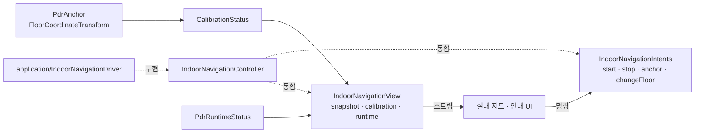
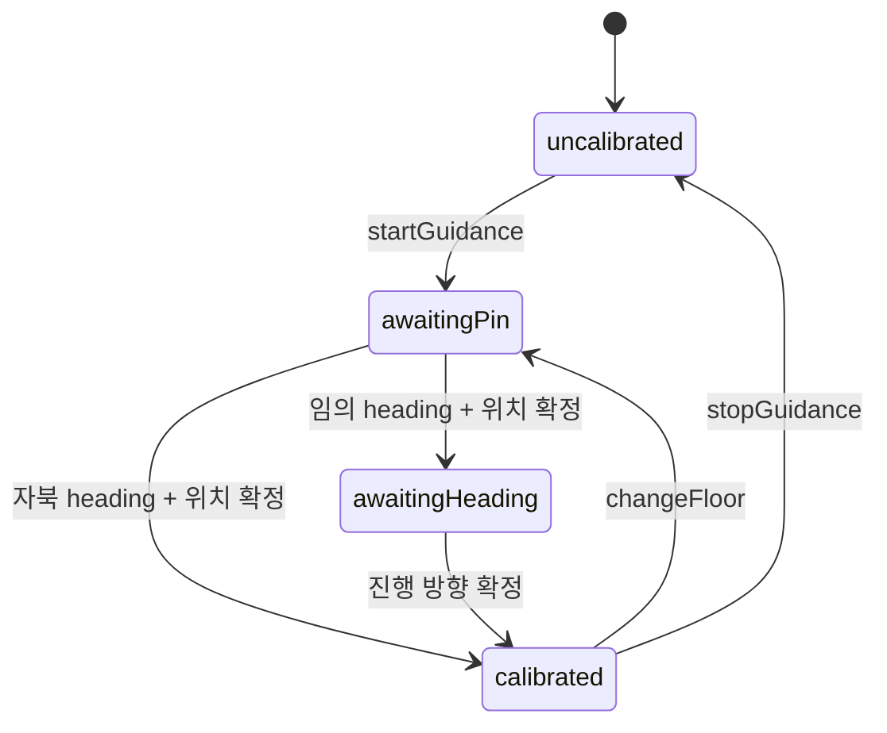

# `indoor_navigation/contract` — UI와 PDR의 공개 계약

UI가 호출할 명령, UI가 구독할 상태, PDR 좌표를 층 좌표에 고정하는 타입을 정의한다.
화면은 application·platform 내부 대신 이 디렉터리의 공개 표면에 의존한다.

## 구성 파일

| 파일 | 역할 | 주요 타입 |
|---|---|---|
| [`indoor_navigation_contract.dart`](indoor_navigation_contract.dart) | 공개 export와 읽기+명령 통합 계약 | `IndoorNavigationController` |
| [`indoor_navigation_intents.dart`](indoor_navigation_intents.dart) | UI → 로직 명령 | `IndoorNavigationIntents` |
| [`indoor_navigation_view.dart`](indoor_navigation_view.dart) | 로직 → UI 읽기 전용 상태 | `IndoorNavigationView` |
| [`calibration_state.dart`](calibration_state.dart) | anchor 확정 단계와 렌더 가능 여부 | `CalibrationPhase`, `CalibrationStatus` |
| [`pdr_anchor.dart`](pdr_anchor.dart) | PDR east/north → 층 `local_m` 변환 | `PdrAnchor`, `PdrToFloorAxes`, `FloorCoordinateTransform` |
| [`pdr_runtime_status.dart`](pdr_runtime_status.dart) | 센서 파이프라인 실행 상태 | `PdrRuntimeState`, `PdrRuntimeStatus` |
| [`altitude_sample.dart`](altitude_sample.dart) | 기압 샘플과 기압계 가용 상태 | `AltitudeSample`, `AltimeterStatus`, `pressureAltitudeM` |
| [`raw_motion_activity.dart`](raw_motion_activity.dart) | 걸음 pause와 무관하게 흐르는 원시 움직임 | `RawMotionActivity` |
| [`floor_transition_ui_state.dart`](floor_transition_ui_state.dart) | 층 전환 배너가 그릴 상태 | `FloorTransitionUiState`, `FloorTransitionStage` |

## 계약 관계



## 보정 상태



`CalibrationStatus.canRenderPosition`은 `calibrated`이고 anchor가 있을 때만 `true`다.
anchor가 없는 추정 위치를 지도에 먼저 그리지 않는다.

## 좌표 변환

```text
floor = anchorLocalM + PdrToFloorAxes × Rotation(rotationDeg) × pdr
```

- PDR 좌표는 동쪽·북쪽이 양수다.
- 층 `local_m`은 데이터셋에 따라 축 회전이나 y축 반전이 있을 수 있다.
- `PdrToFloorAxes`가 축 차이를, `rotationDeg`가 heading frame 어긋남을 담당한다.
  후자는 자북→진북 자편각(`magneticDeclinationDeg`)과 현장/수동 보정의 합이다.

## 실패 지점

- UI가 application 구현체를 직접 참조하면 fake controller로 교체하기 어려워진다.
- 명령 메서드에서 UI 상태를 반환하고 상태 스트림에서도 같은 값을 내보내면 두 진실 공급원이 생긴다.
- `PdrRuntimeStatus.warnings`는 사용자 문구가 아니라 식별자다. 화면에서 그대로 노출하지 않는다.
- anchor 확정 때와 위치 변환 때 서로 다른 `PdrToFloorAxes`를 쓰면 이동 방향이 반전된다.
- `awaitingPin` 또는 `awaitingHeading`에서 위치를 렌더하면 보정 전 좌표가 실제 위치처럼 보인다.
- `AltitudeSample.altitudeM`을 절대 고도로 쓰면 안 된다. 해면기압이 시간당 1~2 hPa(8~16 m)
  움직이므로 baseline과의 **차이**로만 의미가 있다.
- 기압을 위치 추정에 섞으면 HVAC 교란이 걸음 배치까지 흔든다. 층 전이 판정만 이 값을 본다.

## 수직 이동

`rawMotion`은 `pauseStepTracking`으로 걸음 적용을 멈춘 동안에도 흐른다. 판정기가 보던
`steps`는 **위치에 반영된** 걸음 수라 탑승 중 증가하지 않아, 하차 첫 걸음이라는 가장 빠른
근거를 볼 수 없었다. 이 스트림은 위치·경로에 반영되지 않으며 판정기는 수직 속도가 충분히
낮을 때만 하차 보조 근거로 쓴다.

`FloorTransitionUiState`는 판정 단계를 UI 개념으로 한 번만 옮긴다. 화면은 문구와 애니메이션
으로만 바꾸고 고도 임계값이나 노드 근접을 다시 계산하지 않는다. 이 상태를 그리는 주체는
지도 본문이 아니라 앱 셸의 최상위 Stack이다 — 검색창·카테고리 줄이 셸의 형제라, 지도 안에서
그린 배너는 어떤 offset을 줘도 그 뒤에 깔린다.

`applyVerticalTransfer`는 `changeFloor`와 다르다. 층만 바꾸고 사용자 pin을 다시 받는 게 아니라,
확인된 도착 지점을 새 anchor로 놓고 **회전값을 직전 anchor에서 물려받는다**(같은 센서 세션이라
heading frame이 끊기지 않는다). 직전 anchor가 없으면 물려받을 회전값이 없어 아무 일도 하지
않으므로, 그 경우는 `changeFloor` + 사용자 pin으로 가야 한다.

## 검증

공개 계약과 좌표·보정 동작은
[`../../../../test/features/indoor_navigation/contract_test.dart`](../../../../test/features/indoor_navigation/contract_test.dart)에서 확인한다.

---

> **다음 읽기:** [`platform` — Android/iOS 센서 어댑터](../platform/README.md)
