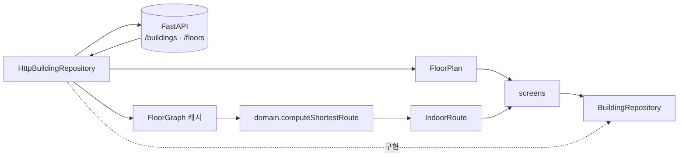

# `lib/repositories` — 데이터 접근 경계

화면이 백엔드·TMAP·assets의 차이를 모르도록 인터페이스로 감싼다. 실제 HTTP 구현과
오프라인/테스트용 Mock이 같은 계약을 구현한다.

## 폴더

`models/`와 같은 세 갈래이고 이름도 맞춰 뒀다 — `building/` · `place/` · `routing/`.
**계약과 그 구현(http·mock·tmap·kakao)이 같은 폴더에 모인다.** 계약을 바꾸면 반드시
함께 고쳐야 하는 것들이라, 떨어져 있으면 한쪽만 고친 채 지나간다.

## 인터페이스와 구현

| 계약 | 실제 구현 | 대체 구현 | 책임 |
|---|---|---|---|
| [`building_repository.dart`](building/building_repository.dart) | [`http_building_repository.dart`](building/http_building_repository.dart) | [`mock_building_repository.dart`](building/mock_building_repository.dart) | 건물·층 지도·층 그래프·건물 전체 그래프, 단일 층 최단 경로 |
| [`destination_repository.dart`](place/destination_repository.dart) | [`http_destination_repository.dart`](place/http_destination_repository.dart) | [`mock_destination_repository.dart`](place/mock_destination_repository.dart) | 목적지·시설 검색과 현재 층 필터 |
| [`directions_repository.dart`](routing/directions_repository.dart) | [`tmap_directions_repository.dart`](routing/tmap_directions_repository.dart) | [`mock_directions_repository.dart`](routing/mock_directions_repository.dart) | 실외 도로 경로 — 도보(`/routes/pedestrian`)와 자동차(`/routes`) |
| [`outdoor_poi_repository.dart`](place/outdoor_poi_repository.dart) | [`tmap_poi_repository.dart`](place/tmap_poi_repository.dart) | 같은 파일의 `UnavailableOutdoorPoiRepository` | 건물 밖 장소 검색(TMAP POI 통합검색) |
| [`transit_repository.dart`](routing/transit_repository.dart) | [`kakao_transit_repository.dart`](routing/kakao_transit_repository.dart) | 같은 파일의 `UnavailableTransitRepository` | 대중교통 경로 후보(카카오맵) |

[`tmap_transit_repository.dart`](routing/tmap_transit_repository.dart)는 배선에서 빠졌지만 지우지 않았다.
TMAP 대중교통 무료 제공량이 하루 10건이라 카카오로 옮긴 것이고, 되돌릴 여지를 남긴다.

구현 선택은 [`../service_locator.dart`](../service_locator.dart)에서 한다.

## 외부 지도 계약에서 조심할 것

경로·검색 두 리포지토리가 `TMAP_APP_KEY`를, 대중교통이 `KAKAO_REST_KEY`를 쓴다.

- **POI 검색은 좌표·거리를 문자열로 준다.** `"frontLat": "37.5665"`, `"radius": "0.25"`(km).
  숫자로 읽으면 첫 검색에서 바로 던진다. `radius` 요청 파라미터도 km 정수다.
- **반경은 기본이 0(제한 없음)이다.** 반경을 걸면 "집에서 더현대 서울까지" 같은 검색이 통째로
  죽는다 — 20 km 떨어진 목적지는 반경 밖이라 결과가 비고, 화면에는 "찾지 못했어요"가 뜬다.
  목적지가 멀다는 것과 그런 곳이 없다는 것은 사용자에게 전혀 다른 이야기인데 후자로 읽힌다.
  대신 `searchtypCd=R`(중심 기준 거리순)로 가까운 후보를 위로 올려, 같은 브랜드의 다른 지역
  지점이 첫 줄에 오는 것을 막는다. 기준점은 GPS를 먼저 쓰고 없으면 지도 중심으로 떨어진다
  (`OutdoorMapBodyState.outdoorSearchCenter`) — 반경이 없으므로 기준점은 **정렬에만** 영향을
  주고, 화면 밖 장소가 검색에서 빠지지는 않는다.
- **대중교통은 경로가 없을 때도 HTTP 200이다.** 카카오는 본문 `status` 문자열로 알린다
  (`OK`·`EQUAL_POINTS`·`STARTNODES_NULL`·`ENDNODES_NULL`·`NO_RESULTS`·`INVALID_REQUEST`).
  이 구분을 잃으면 화면이 네트워크 오류와 같은 문구를 띄우고, 사용자는 눈앞의 목적지를
  두고 재시도만 반복한다.
- **카카오는 "너무 가까움"을 알려주지 않는다.** TMAP은 700m 이내면 거부했는데, 카카오는
  600m 거리에도 12분짜리 버스 경로를 `OK`로 준다. 그래서 호출 **전에** 직선 거리로
  자른다(`KakaoTransitRepository._walkableMeters`).
- **카카오는 첫 승차지점 앞·마지막 하차지점 뒤 도보를 주지 않는다.** 역 안 환승 도보는
  온다. 빠진 양 끝은 [`../domain/route/transit_walk_fill.dart`](../domain/route/transit_walk_fill.dart)가
  보행자 경로로 채운다. 총 시간·거리에는 그 도보가 **이미 포함돼 있으므로** 다시 더하면 안 된다.
- **후보 개수를 요청으로 못 줄인다.** 카카오에는 `count`가 없고 늘 전부 온다(실측 15개).
  정렬한 뒤 우리가 자른다.
- **선 좌표는 두 API 모두 경도가 먼저다.** 담는 그릇만 다르다 — TMAP은 `"경도,위도"` 문자열,
  카카오는 `[[경도, 위도], …]` 숫자 배열이다. 뒤집으면 경로가 서해로 날아간다.
- **한글이 charset 헤더 없이 온다.** 세 리포지토리 모두 `bodyBytes`를 직접 UTF-8로 디코딩한다.

키가 없으면 두 기능은 **꺼진다**(가짜 데이터를 만들지 않는다). 도보 경로 Mock은 방향이라도
맞지만, 없는 가게·없는 버스는 사용자를 실제로 그 좌표까지 걸어가게 만든다.

## 건물·경로 흐름

서버는 그래프를 제공하고, `HttpBuildingRepository.getShortestRoute`가 캐시한 층 그래프를
`domain/floor_router.dart`에 넘긴다. Dijkstra를 백엔드로 옮기지 않는다.

## 목적지 검색

`DestinationRepository`는 두 계약을 노출한다.

- `searchDestinations` — 경량 `POST /query/destination`. 최적 매장 1건을 돌려주며,
  `currentFloorId`가 있으면 현재 층만, `null`이면 건물 전체를 검색한다.
- `searchDestinationsAi` — 탐색(Discovery) `POST /query/ai`. `mode`(direct·clarify·results·
  no_match·degraded) + 질문/선택지 + 여러 후보를 담은 `DiscoveryResult`를 돌려준다. 응답
  계약이 destination과 다르고, 임베딩 의미 검색까지 이어질 수 있어 첫 호출이 수 초 걸릴 수 있다.

`HttpDestinationRepository`가 두 엔드포인트를 모두 호출하고, Mock은 이미 로드된 건물
데이터에서 검색한다. 앱 배선은 기본이 `HttpDestinationRepository`다
(`../service_locator.dart`) — 자연어·탐색 검색 설계는
[`../../../docs/native/client-handoff.md`](../../../docs/native/client-handoff.md)를 참고한다.

## 반환·오류 규칙

- 조회 실패나 경로 없음처럼 화면이 정상 분기할 수 있는 경우는 `null` 또는 빈 목록으로 돌려준다.
- JSON 파싱은 `models/` 생성자에 맡기고, 리포지토리는 endpoint·status·캐시를 책임진다.
- API URL과 키는 `core/api_config.dart`에서만 읽는다.

## 실패 지점

- HTTP 200이어도 `navigation_graph`가 비었거나 node ID가 없으면 경로는 `null`이다.
- `currentFloorId`에 층 표시명(`1F`)을 넘기고 API가 불투명 ID를 기대하면 필터가 실패한다.
- 단일 층 `/floors/{floor}` 그래프로는 층 간 경로를 만들 수 없다. 층 간 경로는 `getBuildingGraph`가 받는 건물 전체 그래프(전 층 노드 + 수직 전이 간선)를 `domain/multi_floor_router.dart`에 넘겨 계산하며, 두 경로를 섞지 않는다.
- Mock과 HTTP 구현의 빈 검색어·없는 데이터 동작이 다르면 테스트만 통과하고 실제 화면이 달라진다.

## 자주 하는 작업

| 하고 싶은 것 | 방법 |
|---|---|
| 새 데이터 소스 추가 | 계약을 먼저 확장하고 실제/Mock 구현을 함께 수정 |
| endpoint·status 처리 변경 | `http_*_repository.dart` |
| JSON 필드 변경 | [`../models/README.md`](../models/README.md)와 백엔드 응답 계약 함께 확인 |
| 경로 계산 변경 | [`../domain/README.md`](../domain/README.md) |

---

> **다음 읽기:** [`lib/state` — 지속되는 사용자 상태](../state/README.md)
