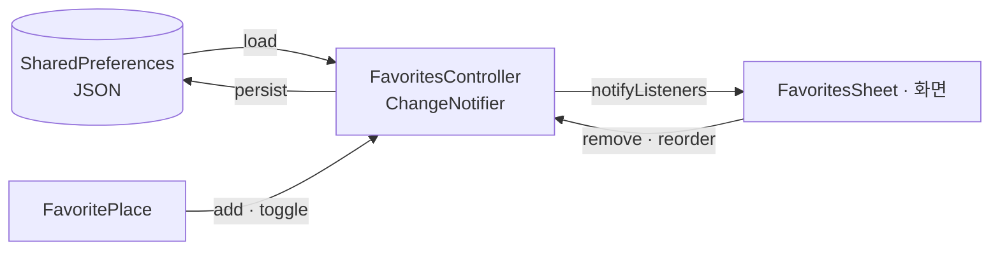

# `lib/state` — 지속되는 사용자 상태

화면 하나보다 오래 유지되고 앱 재실행 뒤에도 복원해야 하는 사용자 상태를 둔다.
현재는 즐겨찾기와 최근 검색어, 최근 출발지·목적지, 수직 이동 선호를 관리한다.

## 구성 파일

| 파일 | 역할 |
|---|---|
| [`favorites_controller.dart`](favorites_controller.dart) | 즐겨찾기 로드·추가·삭제·토글·순서 변경과 저장 |
| [`recent_searches_controller.dart`](recent_searches_controller.dart) | 최근 검색어 로드·추가(최신순)·개별/전체 삭제와 저장 |
| [`recent_route_points_controller.dart`](recent_route_points_controller.dart) | 길찾기에서 실제로 쓴 최근 출발지·목적지 |
| [`vertical_preference_controller.dart`](vertical_preference_controller.dart) | 층을 옮길 때 무엇을 탈지(자동·에스컬레이터·엘리베이터) |

**최근 검색어와 최근 출발지·목적지는 다른 목록이다.** 앞은 사용자가 친 글자라
다시 누르면 검색을 다시 돌지만, 뒤는 노드·층까지 든 `DirectionsCandidate`라 누르면
곧바로 그 지점으로 확정된다. 저장 훅은 `MapShellScreen._startRoute` **한 곳**이다 —
모든 길찾기가 그 함수를 지나므로 시트·검색·지도 탭 어느 문으로 들어와도 남는다.

수직 이동 선호만 목록이 아니라 **값 하나**다. 서버가 이미 정책 파라미터를 받으므로
(`GET /buildings/{id}/graph?vertical=`) 여기서는 고른 값을 보관만 하고, 층 간 경로를
뽑는 화면이 그 값을 질의에 싣는다. 타입과 서버 값 매핑은
[`../domain/route/vertical_preference.dart`](../domain/route/vertical_preference.dart)가
단일 출처다.

나머지 셋은 `ChangeNotifier`이며 `SharedPreferences`의 JSON 문자열에 목록을 저장한다
(즐겨찾기는 `FavoritePlace` 배열, 최근 검색어는 문자열 배열). 즐겨찾기의 앱 전역
인스턴스는 [`../service_locator.dart`](../service_locator.dart)에 있다.

`RecentSearchesController`가 채우는 화면과 그 근거는
[`docs/client/naver-map-ui-ux-analysis.md`](../../../docs/client/naver-map-ui-ux-analysis.md)의
「J. 검색 빈 상태(idle) 채우기」가 단일 출처다. 검색어는 **기기에만 저장하고 서버로
보내지 않는다.**

## 상태 흐름

최근 검색어도 같은 모양이다 — 저장소에서 문자열 목록을 읽고, 검색 실행 시 `add`,
목록에서 `remove`·`clear`, 변경 후 `notifyListeners`와 `persist`. 차이는 (1) 모델
없이 문자열만 다루고, (2) 상한(`maxEntries`)을 넘으면 오래된 것부터 버린다는 점이다.

## 실패 지점

- 초기 비동기 load가 끝나기 전에 빈 목록을 최종 상태로 오해하지 않도록 `isLoaded`를 확인한다.
- `FavoritePlace` JSON 형식을 바꾸면 기존 사용자의 저장값과 호환되는지 확인한다.
- 같은 장소를 판별하는 `key` 규칙을 바꾸면 중복 또는 삭제 실패가 생긴다.
- 테스트에서는 실제 기기 저장소 대신 컨트롤러를 교체하거나 mock preferences를 사용한다.
- 최근 검색어는 부가 기능이라 저장소 읽기·쓰기 실패를 예외로 올리지 않고 빈 목록으로
  degrade한다. 첫 실행의 빈 목록은 오류가 아니라 정상 상태이므로 화면도 그렇게 다룬다.

## 새 전역 상태를 추가할 때

서버에서 다시 받을 수 있는 화면 캐시는 먼저 화면/리포지토리에 둔다. 사용자 선택처럼
재실행 뒤에도 남아야 할 값만 이 계층에 추가하고, 직렬화·마이그레이션·초기 로딩 실패를 함께 설계한다.

---

> **다음 읽기:** [`lib/theme` — 공통 시각 규칙](../theme/README.md)
