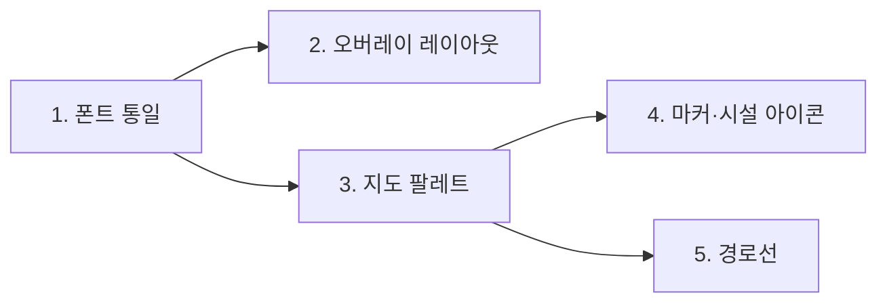

# 지도·상세 UI 개선 계획 (v1)

실내 내비게이션 클라이언트의 지도 표현과 매장 상세 시트를 상용 지도 앱 수준으로
끌어올리기 위한 작업 계획. **0~5번은 완료됐고, 남은 것은 6·7번이다.**

- 설명·주석·커밋은 한국어, 코드·식별자는 영어 (AGENTS.md 규칙).
- 이 문서는 **무엇을 왜 바꾸는지**와 **무엇이 충족되면 맞다고 볼지**를 담는다.
  항목마다 커밋을 나누고, 각 항목의 검증 기준을 통과한 뒤 다음 항목으로 넘어간다.
- 아래 수치와 파일 참조는 `b9d35c9`(main) 기준으로 실제 코드·데이터를 확인한 값이다.

---

## 진행 상태

| # | 항목 | 상태 | 비고 |
|---|---|---|---|
| 0 | 상세 헤더 아이콘·층 표기 | **완료** | PR #71 머지 |
| 1 | 폰트 통일 | **완료** | PR #74 머지 |
| 2 | 지도 오버레이 겹침·여백 | **완료** | PR #74 머지 |
| 3 | 지도 팔레트 대비 | **완료** | PR #74 머지 |
| 4 | 마커·시설 아이콘 | **완료** | PR #74 머지 |
| 5 | 경로선 스타일 | **완료** | PR #74 머지 |
| 6 | 매장 라벨 시스템 | **진행 중** | 아이콘 레이어·타이포그래피 통일(6c) 완료 · 카테고리 색 텍스트와 밀도 필터가 남음 |
| 7 | 길찾기 입력 구조 | **다음 차수** | 시트 chain 재배선으로 범위가 큼 |
| — | 영업시간 | **완료** | B안(구조체 + 실시간 판정). 근거는 [9-1 D2‴](https://github.com/Routex-labs/fastapi/blob/main/docs/place-detail/place-detail-interface.md) |
| — | 연락처 | **완료** | B안(구조체 `contact` + 출처·확인일 필수). 아래 [연락처](#연락처--b안으로-열렸다-2026-08-22) |
| — | 도착지 이름 라벨 | 보류 | 4 이후 |

### 지난 차수 (1~5번, 완료)

1번부터 5번까지 순서대로 진행했다. 번호가 곧 실행 순서였다.
항목마다 커밋을 나눴다.



- **1 → 2**: 폰트가 바뀌면 `MapTopBar`의 높이가 달라진다. 레이아웃을 먼저 잡으면
  폰트 교체 후 다시 봐야 한다.
- **3 → 4, 5**: 마커 테두리 색과 경로선 casing 색은 **배경 대비를 보고 고르는 값**이다.
  배경을 나중에 바꾸면 두 색을 다시 정해야 한다.
- 4와 5는 서로 독립이라 순서 자유.

### 남은 항목 (6·7번)

- **6번(매장 라벨)** — 차단 요인이던 백엔드 작업이 끝났고(아래 6번 본문 참조),
  클라이언트도 대분류 아이콘 레이어와 타이포그래피 통일(6c)까지 왔다. 남은 것은
  **라벨 `textColor`를 카테고리 색으로** 바꾸는 것과 **zoom별 밀도 필터**다.
  `feature/store-icons` 브랜치 이력은 아직 확인이 필요하다(아래 참조).
- **7번(길찾기 입력) — 끝났다.** 입력이 상단 바로 올라왔다. 검색창 자리가
  길찾기 중에는 Runtime Kit의 출발/도착 플래너가 되고, 고치는 위치의 입력 한 줄과
  후보 목록이 그 바로 아래에 붙는다. 이동 수단(도보·자동차·대중교통)은 플래너의
  출발·도착 아래에서 고른다. 출발·도착을 정하면 경로 개요와 `안내 시작`이 보이고,
  그 버튼을 눌러야 조작 배너·남은 값·`안내 종료`로 이루어진 안내 UI로 전환된다.
  `directions_sheet.dart`는 지웠고, 그 시트가 갖고 있던 규칙(거리·도보시간,
  온디바이스 후보, 의미 검색, 출발↔도착 교체)은 상단 바 흐름이 이어받았다.

두 항목의 설계는 아래 본문에 그대로 남겨 둔다 — 착수할 때 이 문서에서 이어받는다.

### 진행 확인 (2026-08-03, main `be56059`)

**이전 판(2026-08-02)의 "1~7번 하나도 착수되지 않았다"는 기록은 틀렸다.**
그 시점에 이미 `feat/map-ui-refresh`에서 1~5번이 진행 중이었고, PR #74로 머지됐다.
아래는 현재 코드에서 다시 확인한 값이다.

| # | 확인한 것 | 파일 |
|---|---|---|
| 1 | `fontFamily: 'Pretendard'` · pubspec에 400·500·600·700·800 등록 | `app_theme.dart`, `pubspec.yaml` |
| 2 | 하드코딩 offset 대신 `_overlayGap` 상수 하나로 쌓은 Column | `map_shell_screen.dart` |
| 3 | 도면 색이 `map_palette.dart` 한곳으로 모임 | `map/style/palette.dart` |
| 4 | 도착 핀 두 화면 통일 · 시설물 텍스트 라벨 제거 | `outdoor_map_screen.dart`, `floor_plan_view.dart` |
| 5 | 진한 테두리 + 진행 방향 화살표, 두 화면 동일 | `map/style/route_style.dart` |
| 6 | 타일에 `category`·`subcategory`는 실림 — **라벨은 아직 `textColor: '#444846'` 고정, 카테고리 아이콘 레이어 없음** | `app/geo/tiling.py`, `floor_plan_view.dart` |
| 7 | **완료** — 상단 바 두 칸 + `route_field_results.dart` 후보 목록, `directions_sheet.dart` 제거 | `map_shell_screen.dart`, `map_top_bar.dart` |

⚠️ **`feature/store-icons` 원격 브랜치가 삭제된 이력이 있다.** 이름이 6번과 겹치는데
PR 목록에도, main에도 흔적이 없다. 누가 착수했다 접었거나 로컬에만 남겨뒀을 수 있으니
**6번을 시작하기 전에 팀에 확인**한다.

---

## 0. 상세 헤더 (완료)

```
66cadaf refactor: 상세 헤더에 카테고리 아이콘을 되살리고 층을 한 줄로 내린다
0721c7e fix: 매장 목록에 영어로 새던 시설 업종을 한글로 보여 준다
12130e5 refactor: 카테고리 아이콘 헬퍼에 대분류 폴백과 한글 표기를 더한다
```

### 무엇이 바뀌었나


**층 배지를 뺀 이유** — 44×44 라운드 사각형은 관습적으로 로고·아바타 자리다.
거기 텍스트가 들어가면 브랜드 마크로 오독된다.

**아이콘을 되살린 이유** — `category_icon.dart`의 아이콘·색 규칙은 이미
카테고리 칩과 카테고리 매장 목록이 쓰고 있었고, 파일 주석에도 "chip과 시트 헤더가
같은 시각 정체성을 갖도록 두 곳에서 공유한다"고 적혀 있다. 상세 시트만 이 시스템에서
이탈해 있었다. 목록에서 보던 글리프가 상세에서도 같은 자리에 있어야 동선이 이어진다.

과거에 지웠던 것은 **모든 매장에 똑같이 붙는 회색 storefront 하나**였다. 지금은
대분류 폴백이 붙어 매장마다 글리프와 색이 달라진다.

### 카테고리 커버리지 (실측)

시트가 열리는 장소는 633개다. (전체 1,640개 중 주차 787 + 에스컬레이터 152 +
엘리베이터 68 = 1,007건은 `kind: excluded`라 시트가 열리지 않는다.)

| 대분류 | 개수 | 아이콘 |
|---|---|---|
| 패션 | 260 | `checkroom` |
| 식음료 | 140 | `restaurant` |
| 편의시설 | 92 | `info_outline` |
| 리빙 | 54 | `weekend_outlined` |
| 뷰티 | 36 | `brush` |
| 서비스 | 30 | `support_agent` |
| 키즈 | 21 | `child_care` |

Studio 원본만 보면 1,640개 중 1,278개가 `category: "매장"`이라 무의미하지만,
`resources/store_categories.json`(id 기준 66건)과 `store_category_by_name.json`
(매장명 기준 494건) 오버라이드를 거치면 **633개 전부가 위 7개 중 하나로 해석된다.**
`storefront` 폴백이 실제로 뜨는 케이스는 없다.

### 곁다리로 고친 것

`restroom`·`facility` 같은 영어 열거값이 업종 문구로 그대로 노출되고 있었다.
화장실 27곳, 편의시설 52곳. 상세 시트와 카테고리 매장 목록 양쪽에서 한글로 바꿨다.

### 검증 결과

`flutter analyze` 이슈 없음 · 테스트 212개 통과 (헤더 관련 6개 신규).

---

## 1. 폰트 통일

### 문제 — 두 겹이다

**(1) 앱 UI 폰트가 아예 미지정이다.**
`client/pubspec.yaml`의 `fonts:` 섹션은 전부 주석 처리돼 있고, `app_theme.dart`에
`fontFamily`가 없다. 즉 **플랫폼 기본 폰트**를 쓴다.

| 플랫폼 | 실제로 쓰이는 폰트 |
|---|---|
| 웹 (Chrome/macOS) | 브라우저 기본 |
| iOS | Apple SD Gothic Neo |
| Android | Noto Sans CJK |

같은 화면이 기기마다 다르게 보인다.

**(2) 지도 라벨 폰트는 Regular 하나뿐이다.**
`resources/fonts/`에는 지도용 Regular 글리프 하나만 둔다. 그래서 지도에서
**굵기로 위계를 만들 수 없다.** 상용 지도는 중요한 POI를 굵게 해서 밀도 속에서도
읽히게 하는데, 우리는 선택지가 없다.

### 제안

**Pretendard로 통일한다.** 세 가지 이유다.

1. **우리 문제가 "좁은 공간의 작은 글자"다.** 카테고리 칩, 업종 줄, 지도 라벨 모두 폭이
   빠듯한 자리다. Pretendard는 자폭이 좁아 같은 자리에 여유가 생긴다.
2. **iOS에서 변화가 가장 작다.** 지금 iOS는 Apple SD Gothic Neo를 쓰는데 Pretendard가
   애초에 그걸 대체하려고 만들어진 글꼴이라 메트릭이 비슷하다. iOS는 거의 그대로 두고
   웹·안드로이드만 끌어올리는 셈이 된다.
3. **지도 라벨까지 같은 가족으로 간다.** `make_glyphs.js`는 글꼴 종류를 가리지 않으므로
   같은 파일로 SDF를 구우면 UI와 지도가 진짜로 한 글꼴이 된다. 이 항목의 원래 목표다.

라이선스는 OFL이라 번들 가능하다.

- 앱: `Pretendard-Regular/Medium/SemiBold/Bold/ExtraBold.otf` → `client/assets/fonts/`,
  `pubspec.yaml`에 실제 사용 weight(400·500·600·700·800)를 모두 등록 + `theme.fontFamily` 지정
- 지도: Regular glyph만 생성 → `resources/fonts/Pretendard Regular/`
- fontstack 이름은 `client/lib/map/style/fonts.dart` 상수 하나로 모은다

### 위험

폰트가 바뀌면 **전체 텍스트의 크기·줄높이·자간이 미세하게 달라진다.** 이미 손본
상세 시트 헤더를 포함해 시트·카드·버튼을 다시 봐야 한다. 그래서 순서를 앞으로 뒀다.

### 검증 기준

- [ ] 웹·iOS에서 같은 화면의 글자 모양이 동일
- [ ] 상세 시트 헤더에서 제목이 2줄로 넘치지 않음 (긴 매장명: `마리떼프랑소와저버/LMC`)
- [ ] 카테고리 칩 텍스트가 잘리지 않음
- [ ] 지도에서 Pretendard fontstack이 non-empty glyph를 로드함

---

## 2. 지도 오버레이 겹침·여백

### 문제

상단 오버레이가 전부 매직 넘버로 쌓여 있다 (`client/lib/screens/map_shell/map_shell_screen.dart`).

```dart
MapTopBar         → Positioned(top: 0)     // 높이가 모드에 따라 변함
SearchPanel       → Positioned(top: 78)    // 하드코딩
_CategoryChipsRow → Positioned(top: 78)    // 하드코딩
_MapPickHintCard  → Positioned(top: 128)   // 하드코딩
_PlaceInfoCard    → Positioned(top: 128)   // 하드코딩
```

그런데 `MapTopBar`는 상태에 따라 높이가 달라진다. 평소엔 한 줄(검색창)이고,
길찾기 draft 상태에선 `_RouteDraftBar`가 **출발/도착 두 줄 + Divider**로 그려진다
(`client/lib/screens/map_shell/widgets/chrome/map_top_bar.dart`).


**겹침과 여백 과다는 같은 원인의 앞뒷면이다.** 78이 두 상태의 어중간한 타협치라
한쪽에선 모자라고 한쪽에선 남는다. 검색 모드의 여백도 동일 원인이다.

### 제안

1. 하드코딩 offset을 버리고 상단 오버레이를 **하나의 Column으로 스택**한다.
   간격이 상수 하나로 통일되고 모드가 바뀌어도 어긋나지 않는다.
2. **길찾기 모드에서 카테고리 칩을 숨긴다.** 칩은 "뭘 찾을까" 탐색 도구인데
   길찾기 draft 상태는 이미 목적지를 정한 뒤다. 검색 모드에 같은 선례가 있고
   코드 주석도 그렇게 적혀 있다 — "검색 중에는 카테고리 열을 접어 두 오버레이가
   겹치지 않게 한다".

### 위험 — 이 항목에서 유일하게 단순하지 않은 부분

`_topBarKey`·`_categoryRowKey`가 **지도 제스처 잠금의 hit-test에 쓰이고 있다.**
지도가 Flutter 위젯이 아니라 MapLibre 플랫폼 뷰라서, 오버레이 위에 포인터가
올라왔을 때 지도가 같이 움직이지 않도록 이 키들의 글로벌 좌표로 판정한다.
Column으로 바꾸면 좌표 계산이 달라질 수 있다.

### 검증 기준

- [ ] 평소 / 검색 / 길찾기 draft 세 모드에서 상단 바와 아래 오버레이 간격이 동일
- [ ] 길찾기 draft 상태에서 카테고리 칩이 보이지 않음
- [ ] 카테고리 칩 위에서 좌우 드래그 시 **지도가 따라 움직이지 않음** (회귀 확인)
- [ ] 칩을 가로로 스크롤할 수 있음
- [ ] `_MapPickHintCard`·`_PlaceInfoCard`도 길찾기 모드에서 상단 바를 안 가림

---

## 3. 지도 팔레트 대비

### 문제

아웃라인은 **이미 있다.** 문제는 대비가 거의 없다는 것이다
(당시 `client/lib/widgets/floor_plan_view.dart`. 그 파일은 뒤에 삭제됐고 같은
스타일은 지금 `map/style/palette.dart`와 실내 오버레이가 들고 있다).

| 요소 | fill | outline | 비고 |
|---|---|---|---|
| 건물 바닥(통로) | `#FFFFFF` | `#00000088` | |
| 매장 폴리곤 | `#F3F1EF` | `#D8D4D1` | **통로와 명도 차 2% 미만** |
| 수직이동 | `#DCEBD4` | `#6FA167` | 이건 잘 보임 |
| 실내 화면 배경 | `#EDF4E7` | — | |

`#FFFFFF`와 `#F3F1EF`가 사실상 같은 색이라 **통로와 매장이 하나의 흰 덩어리로 보인다.**
실내 내비에서 가장 중요한 정보가 "어디로 걸을 수 있나"인데 그게 안 읽힌다.

### 방향은 맞다, 세기만 부족하다

네이버·카카오도 **"걸을 수 있는 곳은 밝게, 막힌 곳은 어둡게"** 규칙을 쓴다
(도로가 흰색, 건물이 회색). 우리도 통로가 흰색이고 매장이 회색이라 방향은 같다.

### 제안


### 위험

- 코드 주석에 **"원본 SVG 디자인(hyundai_floor_map_corrected_v6.svg)의 색상을 그대로
  옮긴다"**고 명시돼 있다. 바꾸면 원본과의 대응이 끊어지므로, 의도적으로 깬다는 걸
  주석에 남겨야 한다.
- 같은 값이 **`client/lib/screens/outdoor_map/layers/indoor_overlay_layers.dart`에도 중복**돼
  있다. 한쪽만 바꾸면 실내 화면과 야외 오버레이의 색이 어긋난다.

### 검증 기준

- [ ] 매장 경계가 통로와 구분되어 보임 (줌 z17, z19 양쪽)
- [ ] 실내 화면과 야외 오버레이의 색이 동일
- [ ] 수직이동(초록)이 여전히 매장과 구분됨
- [ ] 매장명 라벨([`mapLabelStoreColor`](../../client/lib/map/style/label_style.dart)
      + 흰 halo)이 어두워진 배경에서도 읽힘

---

## 4. 마커·시설 아이콘


### 4-a. 도착 핀 — 빨강 채움 + 흰 글씨 + 진한 빨강 테두리

지금은 야외 오버레이 핀이 **단색 빨강**이고, 실내 화면 핀은 **흰 원 + 진한 "도착"
텍스트**다. 두 화면의 핀이 다르고, 어느 쪽도 상용 지도의 도착 마커와 닮지 않았다.

**네이버·카카오 레퍼런스** — 두 서비스 모두 같은 규칙을 쓴다.

- 바탕은 **빨강으로 채운다.** 흰 원을 파서 속을 비우지 않는다.
- 글씨는 **흰색**으로 그 안에 넣는다.
- 마커 실루엣 전체에 **한 톤 진한 빨강 테두리**를 두른다. 흰색이 아니다.

→ **이 규칙을 따른다.** 흰 원을 되살리는 방향은 버린다 — 속을 비우면 마커의 색 면적이
줄어 멀리서 눈에 덜 띈다.

**테두리를 흰색으로 하면 안 되는 이유**는 5번 경로선에서 짚은 것과 같다. 실내 도면
바닥이 `#FFFFFF`라 **흰 테두리는 흰 배경 위에서 아무 일도 하지 않는다.** 경로선의 흰
casing이 안 보이는 것과 정확히 같은 실수를 마커에서 반복하게 된다. 같은 색조를 어둡게
쓰면 흰 배경에서도, 회색 매장 폴리곤 위에서도, 야외 지도 위에서도 경계가 살아난다.

```
핀 머리   빨강(AppColors.dest = #E53935) 채움, 반지름 24
꼬리      머리에서 가늘게 떨어지는 곡선. 현재 핀(직선 탄젠트)보다 얇고 길게
글씨      흰색 "도착". 머리 안에서 숨 쉬도록 현재보다 키운다
테두리    진한 빨강 3px, 머리와 꼬리를 포함한 실루엣 전체
```

⚠️ 진한 빨강의 정확한 값은 정하지 않았다. 문서 도식에는 `#A81B18`을 썼지만 이건
`#E53935`를 어둡게 잡아 본 값이고, **레퍼런스에서 추출한 값이 아니다.** 구현할 때
네이버·카카오 마커를 실제로 열어 확인하거나, `dest`를 기준으로 명도만 낮춘 값을
팀에서 확정한다.

⚠️ 머리 모양이 바뀌므로 실내 핀의 `textOffset: [0, -3.7]`을 **그대로 쓰면 안 된다.**
이 값은 기존 이미지에서 흰 원 중심이 밑변으로부터 112px인 것과 `iconSize/textSize`
비율 0.033을 곱해 나온 값이다. 꼬리 길이가 바뀌면 머리 중심의 상대 위치도 바뀌므로
같은 방식으로 다시 계산한다.

### 텍스트는 반드시 `textField`로 얹는다

야외 핀이 단색인 것은 의도된 결정이었고, 이유를 정확히 읽어야 한다
(`client/lib/screens/outdoor_map/outdoor_map_screen.dart` 주석):

> Flutter 웹 CanvasKit에서 **오프스크린 캔버스로 렌더링한 이미지**에는 한글 글리프가
> 있는 폰트가 자동으로 딸려오지 않아 "도착"이 두부(tofu) 박스로 뭉개진다.
> 반면 **MapLibre의 심볼 텍스트는 매장명 라벨과 동일한 경로를 타서 한글이 정상**이다.

즉 **두부 현상은 캔버스에 굽는 쪽의 문제이고, `textField`는 검증된 해결책이다.**
빨간 원·아웃라인은 캔버스로 그리고(도형이라 글리프와 무관), **"도착" 글씨만
`textField`로 얹는다.** 캔버스에 글씨까지 구우면 웹에서 두부가 된다.

실내 화면이 이미 `textField: '도착'`으로 돌고 있어 offset 계산
(`textOffset: [0, -3.7]`, iconSize/textSize 비율 0.033 고정)을 그대로 쓸 수 있다.
바뀌는 건 `textColor`가 진한 색에서 **흰색**이 되는 것뿐이다.

⚠️ 흰 글씨는 빨강 위에서 대비가 충분하지만 크기가 작아지면 뭉개진다. z16 축소
상태에서 판독되는지 확인하고, 필요하면 `textHaloColor`에 진한 빨강을 줘 획을 살린다.

### 4-b. 시설 아이콘 크기

`indoorIconSizeExpr`는 zoom 16→20 구간에서 `0.33 → 0.6`으로 보간한다.
실내 화면(`kIndoorPoiIconSize = 0.42`)보다 최대값이 크다.

⚠️ **이건 과거 피드백을 뒤집는 변경이다.** 코드 주석:

> 화장실·정수기 같은 시설이 **잘 안 보인다는 피드백에 맞춰** 실내 배율과 같은
> 1.5배로 올렸고

지금 "너무 크다"는 지적은 줌인 상태(z20 근처)에서 나온 것이고, 과거 피드백은
줌아웃 상태에서 나왔다. 같은 보간식의 양 끝이다.

→ **최대값만 `0.6 → 0.45`로 낮추고 최소값 `0.33`은 유지한다.**

> **이후 뒤집힘 (2026-08-10).** `indoorIconSizeExpr`는 삭제됐다. 이 줌 보간값들은
> 화면 배율을 곱하지 않는 스칼라라 고밀도 기기에서 아이콘만 배율만큼 작아졌고
> (배율 3.5에서 매장 배지가 4.4 논리 px), 실내 화면이 이미 내린 "모든 마커는 한
> 크기" 결론과도 갈라져 있었다. 지금은 실내·오버레이가
> [`kIndoorMarkerLogicalPx`](../../client/lib/map/style/floor_facility_style.dart)
> 하나(12 논리 px, 배율 환산)를 함께 쓰고 줌 보간은 없다. 배율 환산은
> **네이티브에만** 적용한다 — 웹은 비트맵이 `pixelRatio: 1`로 등록돼 배율을
> 곱하면 아이콘만 배율배로 커진다(`indoorMarkerIconSize` 주석).

### 4-c. 시설물 텍스트 라벨 제거

에스컬레이터 **152개**, 엘리베이터 **68개**가 전부 매장과 **똑같은 무게의 텍스트
라벨**을 달고 있다. 도면이 "에스컬레이터"로 도배되어 정작 읽어야 할 매장명이 묻힌다.

구글·네이버도 에스컬레이터에 텍스트를 붙이지 않는다. 아이콘이 이미 무슨 시설인지
말하므로 이름은 중복이다. **크기 조정보다 이쪽이 효과가 크다.**

#### 절반만 지워져 있었다 (2026-08-09에 나머지를 지웠다)

같은 시설이 **두 소스로** 들어온다. `stores`(폴리곤)와 `pois`(마커)다. 위에서 지운
것은 `stores` 쪽뿐이라, `pois` 쪽 이름은 그대로 남아 있었다. 게다가 그 이름은
`에스컬레이터`가 아니라 **Studio 원본의 노드 식별자**다.

| 소스 | 개수 | 이름 | 상태 |
|---|---|---|---|
| `stores` 폴리곤 | 에스컬레이터 152 · 엘리베이터 60 · 유아차 E/V 8 | `에스컬레이터` | 4-c에서 제거됨 |
| `pois` 마커 | escalator 152 · elevator 59 | `ES3-UP(TO2F)` · `EV1` | **남아 있었음** |

야외 오버레이는 POI를 아이콘으로만 그리고 이름 레이어가 아예 없어서
**실내 화면에서만** 보였다. 자세한 근거와 필터는
[`poiLabelFilter`](../../client/lib/map/style/floor_facility_style.dart)에 적어 두었고,
후속 정리는 아래 [6c](#6c-라벨-타이포그래피-통일)에서 이어서 다룬다.

### 검증 기준

- [ ] 도착 핀에 "도착"이 두부 없이 표시됨 (**웹에서 반드시 확인** — 두부는 웹 전용 문제)
- [ ] 핀이 빨강으로 채워지고 글씨가 흰색이며 실루엣에 흰 아웃라인이 있음
- [ ] **흰 배경 도면 위**에서 핀 경계가 배경과 구분됨 (아웃라인이 하는 일)
- [ ] z16 축소 상태에서 흰 "도착" 글씨가 뭉개지지 않음
- [ ] 실내 화면과 야외 오버레이의 도착 핀 모양이 동일
- [ ] z16 줌아웃에서 화장실·정수기가 여전히 식별 가능 (**과거 피드백 회귀 방지**)
- [ ] z20에서 시설 아이콘이 매장명을 가리지 않음
- [ ] 에스컬레이터 밀집 구역에서 매장명이 읽힘

---

## 5. 경로선 스타일


### 당시 — 구현이 두 개고 서로 달랐다

(지금은 `map/style/route_style.dart` 하나다. 실내 전용 화면도 삭제됐다.)

| | 야외 + 실내 오버레이 | 실내 화면 |
|---|---|---|
| 파일 | `outdoor_map_screen.dart` | `floor_plan_view.dart` |
| casing | **흰색 8px** | **없음** |
| 본선 | `AppColors.primary` 5px, opacity 1 | `#1A73E8` 5px, **opacity 0.6** |
| 지나온 구간 | 없음 | **회색 처리 있음** (`#9AA0A6`) |

### 문제

1. **흰 casing이 무의미하다.** 실내 도면 배경이 흰색이다. 흰 선 위의 흰 테두리는
   보이지 않는다. 경로선이 맨살로 보이는 직접 원인이다.
2. 실내 화면은 casing도 없는데 **opacity까지 0.6**이라 더 흐리다.
3. 같은 기능인데 두 화면의 값이 다르다.

### 제안 — 네이버·카카오를 따른다

두 서비스 모두 **진한 파랑 아웃라인**을 쓴다. 흰색이 아니다. 그래야 흰 배경·회색
배경 어디서든 선이 떠 보인다. 그리고 그 안에 흰 요소를 넣는다 — 네이버는 흰 chevron
화살표, 카카오는 흰 점선 중앙선.

```
진한 파랑 아웃라인   9px      (신규)
밝은 파랑 본선       5.5px    (기존, opacity 1.0으로)
흰 chevron 화살표    반복     (신규, symbolPlacement: 'line')
+ zoom별 두께 보간
```

**화살표가 가장 체감이 크다.** 방향이 시각적으로 확정되면서 선이 "그려진 선"에서
"가야 할 길"로 바뀐다.

부수 작업: 야외에도 "지나온 구간 회색"을 추가해 실내와 맞춘다 (실내엔 이미 있다).

### 위험

- **층 전환 구간(`_transferRouteLayerId`)에는 화살표를 붙이지 않는다.** 이미
  점선(`lineDasharray`)이고, 그 구간은 수평 이동이 아니라 층 이동이라 방향
  화살표의 의미가 다르다.
- 화살표 아이콘도 `addImage`로 등록해야 한다.
- **흰 casing을 쓰는 레이어가 경로선 말고 하나 더 있다** —
  `_pdrConfirmedTrailCasingLayerId`(PDR 디버그 궤적, `#FFFFFF` 6.25px).
  `#FFFFFF` casing을 일괄 치환하면 이것까지 바뀐다. **디버그 전용이고 이 항목의
  범위가 아니므로 건드리지 않는다.** 대상은 `_routeCasingLayerId` 하나뿐이다.

### 검증 기준

- [ ] 흰 도면 위에서 경로선 경계가 보임
- [ ] 실내 화면과 야외 오버레이의 경로선이 동일하게 보임
- [ ] z16~z20에서 선 두께가 자연스럽게 변함
- [ ] 화살표가 진행 방향(출발→도착)을 가리킴
- [ ] 층 전환 점선 구간에 화살표가 없음
- [ ] 경로 진행 시 지나온 구간이 회색으로 바뀜

---

## 6. 매장 라벨 시스템 <sub>다음 차수</sub>

### 목표

상용 지도처럼 **작은 카테고리 아이콘 + 카테고리 색 텍스트**로 매장 라벨을 그린다.
색만으로 종류가 읽혀서 이름을 다 읽지 않아도 훑을 수 있다.


### ✅ 차단 요인 해소 — 백엔드 선행 작업은 끝났다

`app/geo/tiling.py`의 stores 레이어 properties에 `category`·`subcategory`가
실린다(카테고리 필터 작업에서 함께 처리). MapLibre가 `['get', 'category']`로 색·아이콘을
고를 수 있으므로 이제 클라이언트 스타일링만으로 가능하다.

**6a. 백엔드 (선행) — 완료**
- ~~`tiling.py` stores properties에 `category`·`subcategory` 추가~~ → 값이 `None`이면
  키를 아예 넣지 않는다. 인코더(`mapbox_vector_tile`)가 `None`을 조용히 버리는 동작에
  기대지 않고 계약을 호출부에 둔 것이라, `['has', 'category']`로 판정할 수 있다.
- ~~`tile_cache` 무효화~~ → **추가 조치가 필요 없다.** 캐시는 프로세스 메모리라 배포 시
  재시작으로 비워진다. 다만 응답의 `Cache-Control: max-age=60` 때문에 배포 직후 최대
  60초간 클라이언트가 옛 타일을 들고 있을 수 있다(자연 만료로 자가 치유).
- 타일 크기는 층별로 +7.4~9.4%(최대 +1.1KB) 늘었지만, 같은 작업에서 응답 gzip을 켜
  **전체적으로는 오히려 절반이 됐다**(실측 48% 절감).

**6b. 클라이언트가 참고할 것 — 대분류 어휘가 바뀌었다**

`_colorByCategory` 7종을 재사용하라고 아래에 적혀 있는데, 그 사이 대분류가 **9종**이
됐다. `식음료`가 사용자 말이 아니어서 **음식점·카페·식품관**으로 나뉘었고, 편의시설
소분류의 영어 원본값(`restroom`·`facility` 등)도 한글로 옮겼다. 색은
`client/lib/map/icon/category_icon.dart`가 계속 단일 출처다.

- 카테고리 아이콘 심볼 레이어 추가 (기존 시설 아이콘과 같은 `addImage` 패턴 재사용)
- 라벨 `textColor`를 카테고리 색으로 (`_colorByCategory` **9종** 재사용)
- 중요 매장은 Bold (1번의 선행 조건)

### 6c. 라벨 타이포그래피 통일 <sub>완료 (2026-08-09)</sub>

「매장 글자가 너무 일관적이지 않다」는 피드백에서 출발했다. 코드를 세어 보니
**의도된 위계가 아니라 그때그때 고른 값이 다섯 갈래로 갈라져** 있었다.

| 화면 | 레이어 | 색 | 헤일로 | 크기 |
|---|---|---|---|---|
| 실내 | 매장명 | `#444846` | 1.2 | 9~18 (폴리곤 맞춤) |
| 실내 | 편의시설 이름 | `#444846` | 1.2 | 9~18 (폴리곤 맞춤) |
| 실내 | POI 이름 | `#4F5451` | 1.0 | 10 고정 |
| 야외 | 매장명 | `#333333` | 1.0 | 11 고정 |
| 야외 | 편의시설 이름 | `#333333` | 1.0 | 11 고정 |

글자색 3종·헤일로 2종·크기 3종이다. 하나씩 보면 틀린 값이 없는데, 실내/야외를
오갈 때 같은 매장 이름의 색이 바뀌고, 한 화면 안에서 어떤 글자가 왜 더 진한지
설명할 수 없다.

#### 조사 — 상용 지도가 실제로 하는 것

네이버·카카오는 **지도 스타일 스펙을 공개하지 않는다.** 카카오 공지는 실내지도에서
"화장실·엘리베이터·에스컬레이터 등 편의시설 정보"를 제공한다는 사실만 말하고 표기
방식은 없고, 네이버 도메인은 이 저장소의 에이전트 환경에서 차단돼 있다
([네이버지도 분석 문서](naver-map-ui-ux-analysis.md)의 「캡처 출처와 한계」).
그래서 근거를 두 갈래로 나눠 잡았다.

1. **1차 관찰 — 사람이 캡처한 네이버 화면.** 위 분석 문서의 6장이 그대로 근거다.
   목록에서도 지도에서도 **좌측 아이콘은 2종(돋보기·핀)뿐이고 카테고리는 색이 아니라
   회색 텍스트**다. 즉 네이버는 라벨 색으로 종류를 말하지 않는다 — 6번 본문이
   목표로 잡은 「카테고리 색 텍스트」는 네이버 벤치마크가 아니라 우리 선택이다.
2. **공개된 스펙 — Mapbox Streets `poi-label`.** 같은 랭크의 POI는 zoom 전 구간에서
   **11~14px로만** 움직이고(비 1.27), 밀도는 글자 크기가 아니라 `filterrank`로
   조절한다. 즉 상용 지도의 라벨은 "크기로 중요도를 말하지" 않는다.

우리는 랭킹 데이터(방문량·중요도)가 없어 `filterrank`를 흉내 낼 수 없다. 그래서
폴리곤 맞춤은 유지하되 **폭만 좁히는** 쪽으로 갔다.

#### 한 것

- **[`map/style/label_style.dart`](../../client/lib/map/style/label_style.dart) 신설.**
  색·헤일로·보조 라벨 크기의 단일 출처다([`map_route_style.dart`]와 같은 패턴 —
  두 화면이 반드시 같아야 하는 값은 core에 모은다).
- **색 3종 → 2단계.** `mapLabelStoreColor`(매장명)와
  `mapLabelFacilityColor`(편의시설·POI). 편의시설이 한 단계 옅은 이유는
  **아이콘이 주 신호이고 이름은 보조**라서다. 흰 도면 대비 4.9:1로 본문 기준을 넘긴다.
- **헤일로 1.0/1.2 → 1.2.** 야외는 매장 강조 fill 위에 라벨이 얹혀 1.0에서 획이 먹혔다.
- **편의시설 이름을 폴리곤 맞춤에서 고정 11px로.** 맞춤 계산은 글자가 폴리곤 **안에**
  들어가는 경우의 계산인데, 이 이름은 아이콘을 피해 폴리곤 **밖으로** 내려 그린다.
  전제가 안 맞아 「취식 가능장소」처럼 넓은 시설이 18px까지 커져 이웃을 덮었다.
- **매장명을 2줄까지만 접는다 (`kStoreLabelMaxLines` 3 → 2).** 실기기에서
  `조 말론 런던`이 「조 / 말론 / 런던」 세 조각으로 흩어졌다. 이름 덩어리가 매장보다
  세로로 길어져 세 조각이 각각 다른 매장처럼 읽힌다.
- **줄바꿈 폭 계산의 버그를 고쳤다.** 위 증상의 절반은 3줄 허용이 아니라 계산이
  원인이었다. 목표 폭을 `전체 폭 / 줄 수`로 잡았는데 그건 줄 폭의 **평균**이지
  탐욕 배치가 달성하는 폭이 아니다 — 한글처럼 모든 글자 폭이 같은 이름에서는 평균에
  도달할 수 없어서, 5글자를 3줄로 접으려고 1.85em을 주면 실제로는 **5줄**이 나왔다.
  그 폭을 그대로 `text-max-width`로 내보냈으니 MapLibre도 같은 모양으로 접었다.
  이제 [`storeLabelWrapWidth`](../../client/lib/map/label/store_label_fit.dart)가
  **그 줄 수가 실제로 나오는 가장 좁은 폭**을 찾는다. 덤으로 `조 말론 런던`의
  글자 크기가 오히려 커졌다(2줄이 제대로 잡히면서 가로 예산이 넓어진다).
- **매장명 상한 18 → 14.** 근거는 [`kStoreLabelMaxPx`](../../client/lib/map/label/store_label_fit.dart)
  주석에 있다. ⚠️ **이 값은 예전에 반대 방향으로 튜닝했던 값이다** — 16→18은 z18에서
  상한에 눌리는 매장을 191 → 97개로 줄여 **매장별 비례**를 최대화한 선택이었다.
  이번엔 그 비례가 곧 불균일이라는 피드백이라 되돌린다. **하한 9는 그대로 뒀다** —
  상한을 내리면 심볼이 작아질 뿐이지만 하한을 올리면 충돌로 밀려나는 이름이 늘어난다.
- **수직이동 POI 이름 제거** (위 [4-c](#절반만-지워져-있었다-2026-08-09에-나머지를-지웠다)).

#### 6d. 대분류 아이콘이 사라지던 두 가지 원인 <sub>완료 (2026-08-09)</sub>

"아이콘이 사라졌다", "확대·축소하면 커지거나 줄지 않고 없어진다", "글자에 비해
너무 작다" — 세 피드백이 **한 뿌리가 아니라 두 개의 독립된 버그**였다. 아래 표는
같은 화면에서 zoom을 한 단계씩 올리며 스크린샷의 배지 색 픽셀을 센 값이다
(칩 아이콘 약 2,440px는 상수라 그만큼이 바닥값이다).

| 소스 `maxzoom` | 진입 화면 | +1 | +2 |
|---|---|---|---|
| 18 (기본, 버그) | **0** | 5,956 | **0** |
| 24 (지금) | 50,000 | 11,870 | 4,170 |

**원인 1 — 라벨 GeoJSON 소스의 `maxzoom`이 18이었다.** 실내 지도는 z22까지 쓰는데
그 위에서는 z18 타일을 확대해 재활용하고, 그 상태에서 심볼의 **아이콘만** 통째로
빠진다. 글자와, 타일 소스를 쓰는 POI 아이콘은 멀쩡하다는 점이 단서였다 — 두
레이어의 차이가 소스 종류였다. 값을 올릴 때마다 소실 지점이 정확히 한 단계씩 위로
밀리는 것을 확인하고 스펙 상한(24)에 뒀다([`kStoreLabelSourceMaxZoom`](../../client/lib/map/label/store_label_fit.dart)).

**원인 2 — `icon-size`만 화면 배율을 안 먹고 있었다.** `text-size`는 논리 픽셀이라
MapLibre가 화면 배율을 곱해 그리는데 `icon-size`는 비트맵의 **물리 픽셀**에 곱해진다.
Galaxy S23(배율 3.5) 실측:

| | 설정 | 화면 px | 논리 px |
|---|---|---|---|
| 매장명 글자 | `text-size: 14` | 약 49 | 14 |
| 대분류 배지 | `icon-size: 0.20` | 19 | **5.5** |

주석은 "글자의 1.4배"라고 적고 있었지만 실제로는 **0.4배**였다. 0.20 → 0.24처럼
숫자를 조금 올려서는 닿을 수 없는 격차라, 크기를 **논리 픽셀로 적고 배율을 곱하는**
방식으로 바꿨다(12~18 논리 px).

**걷어낸 낡은 결정들.** 위 두 버그 위에서 잰 값들이라 더 이상 기준이 아니다.

- `icon-size` 상수 `0.14~0.20` → 논리 px + 배율 환산 함수
- **"0.17~0.25로 키웠더니 B1 라벨이 49→38개로 줄었다"** — 배율 버그 위의 실측이다
- **`iconOptional: true`("붐비면 아이콘을 버려 이름을 살린다")** → `false`.
  버리는 쪽이 아이콘이면 사용자에게는 "없어졌다"로 보인다. 대신
  `iconAllowOverlap`·`iconIgnorePlacement`로 배지가 다른 라벨을 밀어내지 않게 했다
- `symbolAvoidEdges: true` — 클라이언트 GeoJSON 소스에는 이득이 없고 타일 경계에서
  심볼을 떨어뜨린다
- `textRadialOffset: 0.18` — 아이콘이 5.5 논리 px이던 시절 값이라 커진 배지가 이름에
  닿았다. 0.32로 올렸다

#### 대분류 아이콘 — 확대 쪽만 키웠다 <sub>위 6d가 대체함</sub>

"동그란 아이콘이 너무 작아 보인다"는 후속 피드백이다. **양 끝을 다르게 다뤘다.**
심볼 하나가 차지하는 폭은 `아이콘 + 간격 + 이름`이고 아이콘과 글자가 그 예산을
나눠 쓰는데, 글자 상한을 18 → 14px로 내린 효과가 zoom 구간마다 다르다.

| zoom | | 아이콘 | 이름(4글자) | 심볼 폭 |
|---|---|---|---|---|
| z20 | 이전 | 19.2px | 4 × 18 = 72px | 약 94px |
| z20 | 지금 (0.24) | 23.0px | 4 × 14 = 56px | **약 82px** |
| z16 | 이전 | 13.4px | 4 × 9 = 36px | 약 51px |
| z16 | 0.17로 올렸다면 | 16.3px | 4 × 9 = 36px | 약 54px — **늘어난다** |

확대 쪽은 글자가 상한에 눌려 있어 상한을 내린 만큼 예산이 남지만, 축소 쪽은 글자가
이미 하한(9px)이라 더 줄어들 여지가 없다. 그래서 **z16은 0.14 그대로, z20만
0.20 → 0.24.** 보간이라 기본 화면인 z18에서도 16.3 → 18.2px로 커진다.
**야외 오버레이는 글자가 11px 고정이라 내려간 예산이 없어 그대로 뒀다.**
(→ 2026-08-10에 뒤집혔다. 오버레이 매장명은 13px으로 올라가 편의시설 이름과 한
값이 됐고, 아이콘도 위 4-b 주석대로 실내와 같은 크기로 합쳐졌다.)

⚠️ **가드 테스트의 기준을 바꿨다.** `test/widgets/category_map_icon_test.dart`가
「아이콘 ≤ 글자의 1.5배」를 지키고 있었는데, 그 1.5는 글자 상한이 18px이던 시절의
대용값이라 상한을 14로 내리자 **아이콘을 예전보다 작게** 강요했다 — 피드백과 정반대
방향이다. 비율 대신 위 표의 **심볼 폭 예산**을 직접 재도록 바꿨다. 대용값이 사라져
조건 자체는 오히려 정확해졌지만, **밀도를 실기기에서 확인해야 하는 것은 그대로다.**

#### 안 한 것 — 시설 아이콘 크기

시설 아이콘(약 40px)은 그대로 뒀다. 4-b의 "안 보인다" ↔ "너무 크다" 양방향
피드백으로 이미 조정된 값이고, 글자가 들쭉날쭉해 보이던 원인도 아니다.

#### 검증 기준

- [x] 실내/야외 라벨이 같은 색·헤일로 상수를 본다
      (`test/map/label_style_test.dart`가 잠근다 — 값이 아니라 **출처가 하나**임을 잠근다)
- [x] 수직이동 POI가 이름 필터에서 빠지지 않는다 (같은 테스트)
- [x] 편의시설 고정 크기가 매장명 크기 범위 안에 든다 (같은 테스트)
- [x] 목표 줄 수가 실제로 나오는 폭을 고른다
      (`test/widgets/store_label_fit_test.dart` — `조 말론 런던`을 회귀 케이스로 박았다)
- [x] 아이콘을 키운 만큼 심볼 폭이 넓어지지 않는다
      (`test/widgets/category_map_icon_test.dart`)
- [ ] 실기기 B1(가장 붐비는 층)에서 `ES*`·`EV*` 코드가 하나도 안 보임
- [ ] `조 말론 런던`이 두 줄로 붙어 나옴 (「조 / 말론 / 런던」 회귀 확인)
- [ ] 상한을 내린 뒤 z19~z20에서 큰 매장 이름이 **작아 보이지 않음**
      (18 → 14는 이 방향의 손해를 감수한 것이라 여기서 확인한다)
- [ ] **B1 한 화면의 매장명 개수가 줄지 않음** — 아이콘을 키운 대가가 여기서 나온다.
      예전에 49 → 38개로 줄었던 그 화면이 기준이다
- [ ] z16 축소에서 아이콘이 이름을 덮지 않음 (축소 쪽은 안 키웠으므로 그대로여야 한다)

### 위험 — 라벨 폭주

매장이 **633개**다. 전부 아이콘을 달면 지금 에스컬레이터처럼 겹쳐 쌓인다.
현재 시설 아이콘은 `iconAllowOverlap: true`로 **충돌 회피를 아예 꺼둔 상태**다.

→ zoom별 표시 필터 + 심볼 충돌 회피를 켜서 밀도를 조절해야 한다.
상용 지도가 하는 것도 정확히 이것이다.

### 검증 기준

- [x] 타일 응답에 `category`가 실림 (`/buildings/.../tiles/{z}/{x}/{y}.mvt` 디코드 확인)
- [x] ~~캐시를 비운 뒤 새 타일이 나감~~ → 배포 재시작이 캐시를 비운다(위 6a)
- [ ] z17 줌아웃에서 라벨이 겹치지 않음
- [ ] z20에서 매장 대부분이 라벨을 가짐
- [ ] 카테고리가 없는 매장(서버가 새 카테고리 추가 시)이 기본 색으로 폴백
- [ ] 카테고리 색 **9종**이 배경(2번에서 바뀐 값) 위에서 모두 판독 가능

---

## 7. 길찾기 입력 구조 <sub>다음 차수</sub>

> **끝난 항목이다.** 아래는 그때의 문제 인식과 설계를 남겨 둔 기록이다. 지금은
> 상단 바 두 칸에서 바로 치고, 후보 목록이 그 아래에 붙는다.

### 문제

길찾기 동작이 **두 군데**에 있었다. 상단 바에 출발/도착 draft가 보이고, 실제
입력은 하단 시트(`directions_sheet.dart`)였다.

### 상용 지도의 공통점

| 서비스 | 입력 필드 | 하단 시트 |
|---|---|---|
| 구글 · 애플 | **상단** | 결과·옵션만 |
| 네이버 · 카카오 | **상단 고정 전용 화면** | — |

**입력 필드는 예외 없이 위에 있다.** 우연이 아니라 **키보드가 아래에서 올라오기
때문**이다. 입력창이 아래 있으면 키보드에 밀려 올라가면서 지도를 다 덮는다.

### ⚠️ 위 근거 중 하나는 낡았다 (2026-08-09 확인)

이 절은 원래 아래 코드를 근거로 들었다.

```dart
resizeToAvoidBottomInset: false   // Scaffold 리사이즈를 끔
_searchPanelMaxHeight(context)    // 키보드 높이를 직접 빼서 계산
```
> **하단 입력을 유지하는 한 이 수동 계산이 계속 따라다닌다.**

**셋 다 지금은 사실이 아니거나 뜻이 다르다.**

| 예전 주장 | 지금 |
|---|---|
| `_searchPanelMaxHeight`가 키보드 높이를 직접 뺀다 | **그 함수는 없다.** 상단 오버레이 Column이 `bottom: MediaQuery.viewInsetsOf(context).bottom` 하나로 처리한다 |
| 하단 입력이라 수동 계산이 따라다닌다 | 시트는 `isScrollControlled: true` + `EdgeInsets.only(bottom: viewInsets.bottom)`라는 **Flutter 표준 패턴**을 쓴다. 수동 계산이 아니다 |
| 입력을 위로 올리면 `resizeToAvoidBottomInset`를 뗄 수 있다 | **못 뗀다.** 그건 입력 위치와 무관하다 — MapLibre PlatformView가 리사이즈되며 화면이 눌리듯 버벅이는 것을 막는 설정이고(`map_shell_screen.dart` 주석), 입력이 위로 가도 그 이유는 그대로다 |

**실기기에서 확인했다**(Galaxy S23, 2026-08-09). 길찾기 시트를 열면 키보드가 올라온
채로도 출발·도착 입력이 **가려지지 않는다.** 즉 검증 기준 1번은 착수 전에 이미
충족돼 있다.

### 그래도 7번은 유효하다 — 근거를 바꿔 적는다

낡은 것은 **기술적 동기**이지 결론이 아니다. 같은 실기기 화면에서 실제로 관찰된 것:

```
시트를 연 순간 지도가 보이는 세로 비율:  약 26%
(시트가 60% + 키보드가 나머지를 덮는다)
```

상단 검색은 같은 상황에서 지도를 훨씬 많이 남긴다. 그리고 원래 문제였던 **"길찾기
동작이 두 군데"** 는 그대로다 — 상단 초안 바에 출발/도착이 보이는데 입력은 하단이다.

**따라서 7번의 근거는 이제 둘이다.**

1. **한 기능이 두 자리에 있다** (상단 초안 바 ↔ 하단 시트). 원래 근거, 그대로 유효.
2. **시트 + 키보드가 지도를 26%만 남긴다.** 길찾기는 "어디서 어디로"를 지도를 보며
   정하는 일인데, 정작 그 순간 지도가 가장 안 보인다.

**"수동 계산 제거"는 더 이상 근거가 아니다.** 아래 검증 기준에서도 뺐다.

### 제안

상단 바의 출발/도착 필드를 탭하면 그 자리에서 아래로 패널이 펼쳐진다(최근·즐겨찾기·
검색 결과). "지도에서 선택", "전체 층에서 찾기"도 이 패널 안으로 들어오고, 하단 시트는
제거한다.


### 위험 (착수 전 판단)

범위가 가장 크다고 봤다. `directions_sheet.dart` 제거 + 시트 chain 계약
(`StoreInfoAction`, `_runSheetChain`) 재배선이라 **상세 시트·카테고리 시트까지
영향이 간다.** 그래서 마지막에 뒀다.

실제로는 시트 chain 계약을 건드리지 않고 끝났다 — 두 칸은 시트가 아니라 상단 바
안에 있어서, `_runSheetChain`을 쓰는 매장·카테고리 시트는 그대로 남았다.

---

## 7+E 합동 설계 <sub>착수 전 · 2026-08-09</sub>

7번과 [E(SearchPanel → 바텀시트)](naver-map-ui-ux-analysis.md)는 **같은 자리를
서로 반대 방향으로 옮기려 한다.** 그래서 따로 착수하면 반드시 한쪽을 되돌리게 된다.

| 항목 | 옮기려는 것 | 방향 |
|---|---|---|
| v1 7 | 길찾기 **입력** | 하단 시트 → **상단** |
| E | 검색 **결과** | 상단 패널 → **하단 시트** |

**둘을 겹쳐 놓으면 하나의 구조가 나온다.**

```
┌─────────────────────────────┐
│  입력      (검색 1줄 / 길찾기 2줄)   │ ← 항상 위. 키보드가 올라와도 안 가려진다
├─────────────────────────────┤
│                             │
│           지도               │ ← 두 모드 모두 여기가 넓어진다
│                             │
├─────────────────────────────┤
│  결과 목록                    │ ← 키보드 위로 밀린다
└─────────────────────────────┘
              키보드
```

이게 구글 지도의 구조이고, 7번이 인용한 표(「상용 지도의 공통점」)가 말하는 것도
정확히 이것이다 — **입력은 위, 결과는 아래.**

### 그래서 순서는 7 → E → F → G다

- **7이 먼저인 이유:** 하단 슬롯을 비워야 E가 들어갈 자리가 생긴다. 지금은 길찾기
  시트가 그 자리를 modal로 점유한다.
- **E가 F·G의 선행인 이유는** [A~J 문서](naver-map-ui-ux-analysis.md)에 그대로 있다.

### 공유 부품 — 이것 때문에 함께 설계한다

따로 만들면 아래 셋이 두 벌씩 생기고, 그게 "시트 chain을 두 번 뜯는다"의 실체다.

| 부품 | 검색 | 길찾기 | 지금 상태 |
|---|---|---|---|
| 두 단계 검색(경량 300ms → 의미 400ms) | `SearchPanel` | `DirectionsSheet` | **이미 두 벌이다.** 각자 디바운스·단계 enum·clarify 화면을 따로 들고 있다 |
| 결과 행(이름 강조·업종·층·거리) | `_storeTile` | 시트의 후보 행 | 두 벌 |
| 키보드 회피 | Column의 `viewInsets` | 시트의 `viewInsets` | 두 벌이지만 둘 다 표준 패턴이라 문제 아님 |

**두 단계 검색이 이미 두 벌이라는 것이 이 설계의 진짜 이유다.** O~T에서 검색 쪽에
넣은 것(후보 거리·최근접 대표·정렬·형제 매장·층 스코프)이 길찾기 쪽에는 **하나도
없다.** 같은 앱에서 같은 말을 쳐도 자리에 따라 다른 결과가 나온다.

### 실패 조건 (착수 전에 정한 것)

- **`DirectionsSheet.show()`는 `await`로 결과를 돌려주는 modal 계약이다.**
  (`DirectionsResult` + `Navigator.pop`) 상단 패널은 modal이 아니므로 이 계약이
  사라진다. `_showStoreInfo`의 `StoreInfoAction.setOrigin/setDestination` → `await
  _openDirections(...)` 흐름이 **전부 상태 기반으로 바뀐다.** 여기가 가장 크고,
  `_runSheetChain`·`_closeSheetChainRequested`가 함께 걸린다.
- **뒤로가기.** 지금은 modal이라 시스템 뒤로가기가 시트만 닫는다. 상단 패널이 되면
  뒤로가기가 화면을 떠나므로 `PopScope`로 직접 받아야 한다. 안 하면 길찾기 입력 중
  뒤로가기 한 번에 앱이 나간다.
- **지도 잠금.** `_withMapsLocked`가 시트가 떠 있는 동안 지도 제스처를 잠근다.
  상단 패널은 `_searchPanelKey`처럼 hit-test 키로 바꿔야 한다.
- **초안 유실.** `_routeDraftDestination`·`_selectedOrigin`은 지금 시트 결과로
  갱신된다. 상태 기반이 되면 갱신 시점이 바뀌므로, 패널을 닫았을 때 방금 고른 값이
  남아 있는지 경로마다 확인해야 한다.
- **야외/실내 분기.** 시트는 열리는 시점의 `_indoorContextActive`로 의미 검색 여부를
  정하고, 떠 있는 동안 지도가 잠겨 그 판정이 유지된다. 패널은 지도가 살아 있으므로
  **여는 도중에 모드가 바뀔 수 있다.** 그 순간 후보의 성질이 달라진다.
- **E 쪽 — 키보드가 결과를 덮는다.** 결과가 하단으로 내려가면 시트가 키보드 위로
  올라와야 한다. 표준 패턴이 있으니 어렵지 않지만, **지도 카메라가 시트 높이를 알아야**
  선택한 매장이 시트 뒤에 숨지 않는다(카테고리 시트가 이미 같은 보정을 한다).

### 검증 기준

- [x] 키보드가 올라와도 입력 필드가 가려지지 않음 — **착수 전에 이미 충족**
      (위 「낡았다」절, 실기기 확인)
- [ ] 출발·도착을 서로 바꾸는 동작이 유지됨
- [ ] 상세 시트에서 "도착"을 눌러 넘어오는 기존 chain이 깨지지 않음
- [ ] 뒤로가기로 draft가 유실되지 않음 (`PopScope`)
- [ ] 길찾기 입력 중 지도가 보이는 비율이 26%보다 크다 (실기기 실측)
- [ ] 길찾기 후보 목록이 검색 결과와 **같은 행**을 쓴다 (거리·최근접 대표·정렬)
- [ ] 두 단계 검색 로직이 한 벌이다 (두 화면이 같은 코드를 부른다)

~~`resizeToAvoidBottomInset` 수동 계산을 제거할 수 있음~~ — 위 「낡았다」절 참고.
그 설정은 MapLibre 때문이고 입력 위치와 무관하다.

### 범위 추정

`directions_sheet.dart` 1,206줄 제거 + `map_shell_screen.dart` 1,991줄 중 시트
chain 관련부 재배선 + `SearchPanel` 1,400여 줄의 이동. **한 번에 끝낼 수 있는
크기가 아니고, 중간 상태가 깨진 채로 남으면 안 되는 종류다.** 착수하려면 아래
순서로 각 단계가 그 자체로 동작하게 쪼갠다.

1. 두 단계 검색을 **공용 컨트롤러**로 뽑는다(화면 변경 없음, 테스트로 덮음)
2. 길찾기 후보 행을 검색 결과 행과 같은 부품으로 바꾼다(화면 변경 없음)
3. 길찾기 입력을 상단 패널로 올리고 시트를 제거한다 (7번)
4. 검색 결과를 하단 시트로 내린다 (E)
5. 결과 행에 출발·도착 (F) → 목록↔핀 연동 (G)

**1·2는 화면을 안 바꾸면서 두 벌을 한 벌로 만든다.** 거기까지만 해도 O~T가 길찾기
검색에도 적용되므로, 3 이후를 미뤄도 손실이 크지 않다.

---

## 해소된 항목

### 연락처 — B안으로 열렸다 (2026-08-22)

> **이 절은 끝났다.** 영업시간이 2026-08-11에 B안으로 떠났고, **연락처도 같은 길로
> 따라갔다**(2026-08-22). 아래 논의는 그 결정에 이르는 기록으로 남긴다.
>
> 스키마 v5의 `contact`가 그것이다 — `tel`·`source`·`confirmed_at`이 전부 필수인
> 구조체이고, 하나라도 없으면 서버가 섹션을 만들지 않는다. `demo_allowlist`는 걸지
> 않아 전 매장에 쓸 수 있다. 지금 403곳에 들어가 있다.
>
> **"B가 연락처에도 통할까"의 답은 통한다였다.** 아래에서 걱정한 것은 "구조를 준다고
> 낡음이 잡히지 않는다"였는데, 낡음을 잡는 것은 구조가 아니라 **출처와 확인일**이었다.
> 번호가 바뀌면 여전히 조용히 틀리지만, `source`를 열면 그 자리에서 확인할 수 있고
> `confirmed_at`이 며칠 지난 값인지 말해 준다. 영업시간이 "지금 영업 중"을 계산하기
> 위해 구조체가 필요했던 것과 이유는 다르고, 도착한 답은 같다.
>
> 아래 **"연락처 확대 시 정할 것"의 두 질문도 답이 났다.** 출처는 더현대 서울 공식
> 층별 안내(`/store/floor-guide`)이고, 매장 직통 번호가 거기 있어 `1522-3232`(전국
> 공통 고객센터)를 쓸 이유가 사라졌다. 라벨은 `전화번호`다.

⚠️ **이건 UI 작업이 아니다. 저장소가 의도적으로 금지하고 있고 코드로 강제한다.**

`resources/store_details/_schema.json`의 `forbidden_labels`:

```
"영업시간", "영업 시간", "운영시간", "운영 시간",
"전화", "전화번호", "대표번호", "연락처", "문의", "평점", "리뷰"
```

`app/repositories/place_details.py`가 시드 **적재 전에** 검증 실패시킨다.
스키마 주석에 남은 이유:

> 출처가 없어 검증할 수 없고, 영업시간류는 시간이 지나면 자동으로 거짓이 된다.
> 한때 businessInfo가 이 검사를 건너뛰어 **출처 없는 영업시간·대표번호가 응답에
> 실려 나간 적이 있다.**

즉 **이미 한 번 사고가 났고 그래서 막아둔 규칙**이다. JSON에 값만 넣으면 시드가
죽고, 검증만 빼면 그때 사고를 반복한다.

**선택지**

| 안 | 내용 | 평가 |
|---|---|---|
| A | `forbidden_labels`에서 빼고 `source` URL 필수화 | 정직하지만 "영업 중" 판정 불가. **한 번 시도했다 철회**(9-1 D2′) — 조건부 예외가 곧 우회 경로가 됐다 |
| B | **전용 구조체 필드로 승격** + `source` 필수 | **채택.** 영업시간 2026-08-11(9-1 D2‴) · 연락처 2026-08-22(`contact`) |
| C | "데모 데이터" 배지 달고 그냥 표시 | 비추 — 결국 거짓이 화면에 뜬다 |
| D | **`demoInfo` + 매장 허용 목록** | 연락처가 2026-08-10~08-22 머물던 자리. 지금은 B안으로 옮겼고, 여기 남는 것은 영업시간·연락처가 아닌 낡는 값뿐이다 |

**B가 영업시간에서 통한 이유**가 연락처에도 그대로 적용될지는 아직 모른다. 영업시간은
"지금 영업 중"이라는 **계산이 필요해서** 구조체가 값을 했다. 전화번호는 계산할 것이 없고
낡는 방식도 다르다 — 번호가 바뀌면 조용히 틀리는 게 아니라 아예 안 걸린다. 구조를 준다고
낡음이 잡히지 않으므로, 같은 답을 복사하지 말고 따로 판단한다.

**연락처 확대 시 정할 것**

- **출처를 뭘로?** — 더현대서울 공식 매장 페이지 URL 하나로 정하면 될 것 같지만
  **이건 사람이 결정해야 한다**
- 지금 값(`1522-3232`)은 매장 직통이 아니라 **전국 공통 고객센터**다. 라벨을
  `고객센터`로 바꿀지 등은 [다음 작업 순서 3번](https://github.com/Routex-labs/fastapi/blob/main/docs/place-detail/next-steps.md)

**UI 배치 — 반영된 것과 남은 것**

| 위치 | 내용 | 상태 |
|---|---|---|
| 홈 탭 맨 위 | `영업 중 · 20:00 종료` 한 줄 + 오늘 줄(나머지 요일은 접음) | **반영됨.** 섹션 배열이라 "헤더 바로 아래"까지는 못 가고, 서버가 정한 순서에서 가장 위다 |
| 소개 → 사진 → 메뉴 | 지금 그대로 | 유지 |
| 매장 정보 | 연락처 · 주소 | **반영됨.** 연락처는 `demoInfo`를 떠나 `contact` 섹션이 됐고, 서버가 정한 순서에서 영업시간 바로 아래다 |

연락처는 탭하면 전화가 걸린다(복사 버튼은 남긴다 — 다이얼러가 없는 기기가 있다).
주소를 맨 아래로 내린 기존 판단은 유지한다.

---

## 보류 항목

### 도착지 이름 라벨 배지

네이버·카카오는 텍스트를 핀 **안**에 넣지 않는다.

```
  [도착]     ← 둥근 배지
    ▼        ← 핀
 수유리우동집  ← 도착지 이름
```

정보량이 훨씬 많고 **출발 마커도 따로 있다** (우리는 현재 위치 점뿐). 대신
레이어·배지 이미지·라벨 충돌 처리가 붙어 비용이 크다. 4번(핀 통일)이 끝난 뒤 판단.

---

## 참고 — 색상 팔레트

`client/lib/theme/app_theme.dart`

| 이름 | 값 | 용도 |
|---|---|---|
| `primary` (`blue500`) | `#4A87F1` | 주 액션, 층 표기, 경로선 |
| `blue50` | `#EEF4FE` | 보조 버튼 배경 |
| `blue100` | `#D6E4FC` | 구분선, 가운뎃점 |
| `dest` | `#E53935` | 도착 핀 |
| `muted` | `#757575` | 보조 텍스트 |

카테고리 색·아이콘은 [`client/lib/map/icon/category_icon.dart`](../../client/lib/map/icon/category_icon.dart)의
`_colorByCategory`·`_iconByCategory`가 **단일 출처**다 (6번에서 라벨 색으로 재사용).
여기에 표를 베껴 두면 반드시 한쪽이 먼저 썩으므로 값은 옮겨 적지 않는다 — 실제로
그렇게 썩어서 이 문단이 됐다.

패션·음식점·카페·뷰티·식품관 다섯 갈래는 지정된 Pantone 색을 쓰고(각각 536 C·
7612 C·7508 C·700 C·557 C), 나머지 네 갈래(서비스·리빙·편의시설·키즈)는 그 다섯
색의 톤 대역에 맞춘 뮤트 파스텔이다 — 선정 근거는 `_colorByCategory` 위 주석 참고.

> **낡음 (2026-08-10).** 이 자리에 있던 색 표는 지정 Pantone 색 이전 값이었고,
> 대분류 어휘도 `식음료`가 음식점·카페·식품관으로 나뉘기 전이었다. "뷰티
> (`#E53935`)가 도착 핀 색(`dest`)과 겹친다"는 경고도 함께 있었는데, 뷰티는 지금
> `#F2ACB9`라 그 문제는 사라졌다. 이 문서의 삽화(`images/*.svg`)는 그때의 색을
> 그대로 쓰고 있다 — 당시 설계안의 기록이라 고치지 않는다.

---

## 작업 규칙

- **항목마다 커밋을 나눈다.** 한 커밋에 두 항목을 섞지 않는다.
- 커밋 제목은 한 줄, `feat:`/`fix:`/`refactor:`/`style:`/`chore:` 접두사 + 한글.
- `Co-Authored-By` 및 협업자 태그는 붙이지 않는다.
- 각 항목의 검증 기준을 통과한 뒤 커밋한다. **특히 "회귀 방지"로 표시된 항목은
  과거 피드백을 뒤집는 변경이므로 반대 상태를 반드시 같이 확인한다.**
- 로컬 확인은 `client/`에서 `flutter run --dart-define-from-file=config.local.json`.
  코드를 고친 뒤에는 실행 중인 터미널에서 `r`(hot reload)만 누르면 된다.
  `pubspec.yaml`·`config.local.json`을 건드렸을 때만 재시작이 필요하다.
