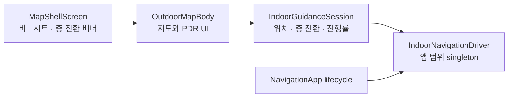
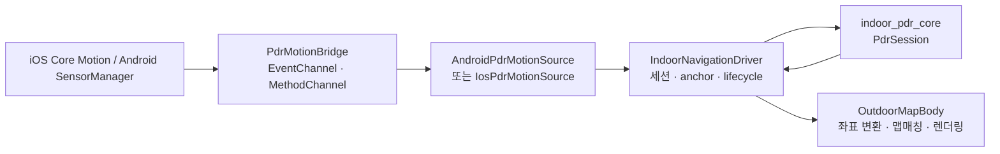
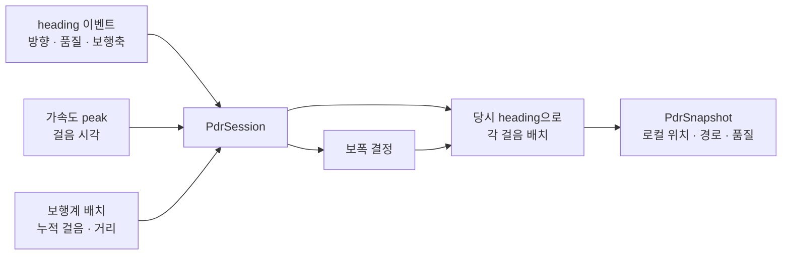

# PDR 앱 통합 가이드

이 문서는 현재 앱에 연결된 PDR(Pedestrian Dead Reckoning)의 구조와 동작을 설명한다.
센서 실험용 랩의 화면·경로 색상·비교 지표가 아니라, 사용자가 실내 지도에서 PDR을
시작하고 위치를 보며 길찾기에 사용하는 흐름을 기준으로 한다.

## 1. 현재 적용 범위

PDR은 `MapShellScreen`의 **실내 지도 모드** 안에 붙어 있다. 실내 지도에서 사용자가
시작 위치를 지정하면, 이후 휴대폰 센서로 계산한 상대 이동을 해당 층의 지도 좌표로
바꾸고 통행 그래프 위에 표시한다.

- PDR은 GPS 대체용 절대 위치가 아니라 **시작점 기준 상대 위치**를 계산한다.
- 따라서 지도에서 현재 위치를 한 번 지정해야 위치 표시가 시작된다.
- 센서 세션은 **실내 지도를 보는 동안 상시 실행**된다. 사용자가 위치를 지정하는 순간
  heading이 이미 수렴하고 보폭 추정이 안정돼 있게 하려는 것이다 — 예전처럼 버튼을 누른
  직후부터 세션을 시작하면 그 워밍업 구간이 주행 초반 오차로 남았다.
- 위치와 이동 경로는 navigation graph가 있는 층에서만 표시할 수 있다.
- PDR이 활성화된 상태에서 다른 화면으로 이동해도 세션은 유지된다. 앱이 백그라운드로
  가면 센서를 멈추고, 복귀하면 다시 시작한다.

## 2. 프론트엔드 결선 위치

PDR UI와 지도 렌더링은 아래 파일에 모여 있다.

| 구분 | 위치 | 역할 |
|---|---|---|
| 지도 셸 | `client/lib/screens/map_shell/map_shell_screen.dart` | 상단·하단 바와 시트를 조립하고 권한을 요청한다. 층 전환 배너·덮개도 여기서 그린다. |
| 지도 + PDR UI | `client/lib/screens/outdoor_map/outdoor_map_screen.dart` | 지도 하나가 실외와 실내를 모두 그린다. 시작점 지정, 방향 보정 대화상자, 위치·경로 렌더링, JSON 공유를 담당한다. |
| 실내 안내 세션 | `client/lib/features/indoor_navigation/application/indoor_guidance_session.dart` | 위치·층 전환 판정·경로 진행률·이탈 증거를 소유한다. 위젯을 모르는 headless 클래스다. |
| 전역 세션 생성 | `client/lib/service_locator.dart` | 플랫폼별 센서 소스와 `IndoorNavigationDriver`를 앱 범위 singleton으로 생성한다. |
| 앱 lifecycle 연결 | `client/lib/app.dart` | `NavigationApp`이 background/foreground 변화를 driver에 전달한다. |

`OutdoorMapBody`는 driver의 snapshot·calibration·기압·원시 움직임 stream을
구독해 `IndoorGuidanceSession`에 넣고, 세션이 내주는 위치 한 건과 그 출처
(`tracked`/`anchorOnly`/`estimate`)를 지도 레이어에 그린다. 실내 길찾기의 출발
노드도 PDR 현재 위치가 있으면 그 위치를 우선 사용한다.



## 3. UI 동작

### 시작부터 위치 표시까지

1. 실내 지도의 층 도면이 준비되면 driver가 센서 스트림과 걸음 세션을 자동으로 시작한다.
   걸음 센서 권한이 거부돼 있으면 자동 시작을 시도하지 않는다 — 화면 진입마다 재시도하면
   `sensorStartFailed` degraded만 반복해서 쌓인다.
2. 사용자가 하단 바의 `위치 지정`을 누른다. 지도에 navigation graph가 없으면 안내
   메시지만 표시한다. 권한 때문에 세션이 아직 idle이면 이 시점에 한 번 더 시작을
   시도한다 — 사용자의 명확한 의사 표시이기 때문이다.
3. 이전 anchor 기준의 궤적과 보정 상태를 비우고 `현재 위치를 지도에서 탭하세요` 안내를 띄운다.
4. 사용자가 현재 서 있는 지점을 탭하면 화면 좌표를 층의 `local_m` 좌표로 변환해 anchor 후보로 전달한다.
5. 기기가 자북 기준 heading을 제공하면 anchor가 바로 확정된다. 그렇지 않으면 `위쪽·오른쪽·아래쪽·왼쪽` 중 현재 기기가 향한 도면 방향을 고르는 대화상자가 열린다.
6. anchor가 확정된 뒤에만 현재 위치와 이동 경로를 지도에 표시한다.

시작점을 확정하기 전에는 계산 중인 상대 좌표를 지도에 표시하지 않는다. 사용자가 지정한
실제 지도 위치와 PDR 좌표계를 연결하기 전에는 지도상 위치가 의미 없기 때문이다.

### 사용 중 동작

- 지도에는 PDR 원본 좌표를 층 좌표로 변환한 뒤, 통행 가능한 navigation graph에 맞춘
  현재 위치와 경로가 표시된다.
- PDR 위치가 있으면 실내 길찾기는 그 위치에서 가장 가까운 매장 입구 노드를 출발점으로
  잡는다. PDR 위치가 없을 때는 기존의 임시 출발점 방식을 사용한다.
- PDR 실행 중 층을 바꾸면 현재 세션과 보행계 기준을 초기화하고 새 층의 시작점 지정을
  다시 요청한다.
- **에스컬레이터로 층을 옮기면 기압계가 이를 감지해 도면·경로를 자동으로 바꾸고, 새 층의
  에스컬레이터 도착 지점으로 위치를 옮긴다.** 이때는 시작점을 다시 지정하지 않는다 — 같은
  센서 세션이라 방향 기준이 유지되므로 회전값을 그대로 물려받는다. 전환을 되묻는 버튼은
  없다 — 판정기가 스스로 취소한 경우에만 화면이 직전 층·위치로 되돌린다. 판정 조건과 범위 한계는
  [`client/lib/features/indoor_navigation/application/README.md`](../../client/lib/features/indoor_navigation/application/README.md)
  에 있다.
- 시작점 지정 중에는 취소 버튼으로 배치 모드만 빠져나온다(세션은 계속 돈다).

### 진단 세션 경계와 내보내기

진단 JSON의 단위는 **한 번의 길안내**다. 경로가 계산되면 세션을 새로 열고, 경로가
해제되면 닫은 뒤 `JSON 공유` 안내를 띄운다. PDR이 상시 실행이라 "시작~종료"를 경계로
쓸 수 없기 때문이다 — 앱을 열어둔 내내 쌓으면 품질 표본(900)·tracker 이벤트(4000)
상한에 걸려 정작 분석하려는 주행 구간이 앞에서부터 잘려 나간다. 경로 단위로 끊으면
파일 하나가 v11 경로 지표와 같은 단위를 담는다.

공유 버튼은 디버그 모드가 켜져 있고 내보낼 세션이 있을 때만 지도에 나타난다. 이 JSON은
현장 거리·heading·맵매칭·경로 이탈을 분석하기 위한 디버그 자료이며, 일반 사용자 흐름의
필수 단계는 아니다.

`pedometer_finalize` 블록(걸음 live/재조회 대조)은 `stopGuidance` 시점에만 채워지므로
경로 단위 세션에서는 비어 있다. 그 대조가 필요하면 앱을 백그라운드로 보내 세션이 멈춘
뒤의 파일을 봐야 한다.

#### 스키마 이력 — 각 판이 무엇을 못 보게 하고 있었나

`PdrDebugSessionRecorder.schemaVersion`. 판을 올린 이유는 전부 같다 — **파일만 보고는
가릴 수 없는 것**이 있었다. 새 필드를 넣을 때 이 표에 한 줄 더한다.

| 판 | 추가한 것 | 그전에는 무엇을 못 가렸나 |
|---|---|---|
| v4 | 1 Hz 샘플의 preview(주황), pedometer live/재조회 대조 | 시계열에 confirmed(초록)만 있어 주황이 언제 벌어졌는지 몰랐다 |
| v5 | heading 분해(fused/offset/device/gyro/walkDir)와 수렴 상태 | 방향이 틀어졌을 때 자력계·walkOffset·네이티브 유도식·실제 회전 중 무엇인지 |
| v6 | Android RoNIN 자동보폭 비교 경로, 1 Hz 보폭/속도 관측 | — |
| v7 | 세션형 복도 보정 위치·heading bias·상태 전이 시계열 | — |
| v8 | 간선 누적 진행거리, 잠긴 진행 방향 | — |
| v9 | 주황 기반 보라 preview 위치·후보 간선·모호성·경로 | — |
| v10 | corridor tracker의 **입력 이벤트** | 출력(경로·1 Hz 샘플)만 있어 tracker를 정확히 재생할 수 없었다(주황 꼬리와 배치 경계가 없었다) |
| v11 | 길찾기 경로 기준 진행률(경로 컨텍스트 + 시계열) | "어느 복도든 하나에 붙었는지"만 알 수 있었고, 정작 중요한 "사용자가 따라가는 그 경로에 붙었는지"는 계산조차 못 했다 |
| v12 | 기압계 시계열, 층 전이 판정 이벤트(**거부 이유 포함**) | 에스컬레이터 임계값이 전부 초안값인데 원본 기압과 거부 이유가 없어 조정할 근거가 없었다. 확정만 남기면 **미탐은 파일에서 아예 보이지 않는다** |
| v13 | optimistic(화면) cursor 상태 — 간선·진행거리·선행분·peak 합성 여부 | "preview 선행분"이 scalar 하나였고 매 프레임 재계산이라, 화면이 뒤로 간 프레임이 배치 때문인지 후보 교체 때문인지 몰랐다 |
| v14 | orientation/walking/map-matched/route heading 분리, peak별 graph traversal, route signed 이동, measured/display 진행률 분리 | — |

## 4. 앱 구조와 데이터 흐름



### 플랫폼 경계

Android와 iOS 모두 다음 채널 계약을 사용한다.

| 채널 | 방향 | 용도 |
|---|---|---|
| `navigation_client/pdr_motion` | native → Flutter | heading, 걸음·보행계, 가속도 피크가 담긴 이벤트 stream |
| `navigation_client/pdr_motion_cmd` | Flutter → native | `resetPedometer`, `finalizePedometer` 명령 |

Flutter 쪽 어댑터는 raw platform map을 `NativePdrEvent`로 바꾸는 역할만 한다. 어떤
걸음 수와 방향을 위치 계산에 반영할지는 `IndoorNavigationDriver`와 PDR core가 결정한다.
native 구현은 다음에 있다.

```text
client/android/app/src/main/kotlin/com/navigation/navigation_client/PdrMotionBridge.kt
client/ios/Runner/PdrMotionBridge.swift
```

### 세션 소유와 lifecycle

`IndoorNavigationDriver`는 위젯과 분리된 headless 컨트롤러다. `service_locator.dart`에서
한 번 생성되므로 지도 위젯이 다시 만들어져도 센서 세션과 계산 상태를 다시 만들지 않는다.

- `startGuidance`: PDR core와 native pedometer를 새 세션으로 초기화하고 센서 스트림을 연다.
- `stopGuidance`: 마지막 pedometer 상태를 반영하고 센서를 중지한다.
- background: core를 pause하고 native 센서를 멈춘다.
- foreground: native 센서를 다시 시작하고 core를 resume한다.
- `changeFloor`: 새 pedometer 세션을 열고 anchor를 다시 받는다.

UI가 호출하는 명령과 UI가 구독하는 상태는
`client/lib/features/indoor_navigation/contract/`에 분리되어 있다. 이 경계 덕분에
지도 UI는 센서 구현을 직접 알 필요가 없다.

## 5. PDR 메커니즘

PDR 계산 코어는 `packages/indoor_pdr_core/`에 있으며 Flutter 위젯·플랫폼 채널·지도에
의존하지 않는다. 센서마다 다른 원시 값을 platform bridge가 typed 이벤트로 정리하고,
`PdrSession`이 이 이벤트들을 조합해 세션 시작점 기준의 로컬 미터 경로를 만든다.



### iOS와 Android의 차이

두 플랫폼은 같은 `NativePdrEvent` 계약을 만들지만, OS가 제공하는 센서 값과 신뢰할 수
있는 기준은 다르다.

| 항목 | iOS | Android |
|---|---|---|
| native 구현 | `client/ios/Runner/PdrMotionBridge.swift` | `client/android/app/src/main/kotlin/com/navigation/navigation_client/PdrMotionBridge.kt` |
| 방향의 기본 입력 | `CMMotionManager.deviceMotion` | `FusedOrientationProvider`, 끊기면 `TYPE_ROTATION_VECTOR`, 그것도 없으면 `TYPE_GAME_ROTATION_VECTOR` |
| 방향 기준 | `.xMagneticNorthZVertical`을 우선 사용하고, 불가하면 `.xArbitraryCorrectedZVertical` | FOP와 일반 rotation vector는 자북 기준, game rotation vector는 절대 북 기준이 아님 |
| 걸음 수 기준 | `CMPedometer.numberOfSteps` | `STEP_COUNTER`가 들어오면 이를 우선; 아직 live가 아니면 `STEP_DETECTOR`를 fallback으로 사용 |
| 거리·보폭 입력 | OS 거리, cadence, pace를 제공할 수 있음 | OS 거리·pace는 없음. cadence와 가속도 amplitude는 진단용 후보만 계산 |
| 권한 | 앱 시작 시 sensor 권한 요청 | Android 10 이상에서는 `ACTIVITY_RECOGNITION` 권한이 있어야 step 센서를 등록 |

두 플랫폼 모두 기기의 상단 축을 기본 진행 방향으로 사용한다. 휴대폰이 세워진 경우에는
후면 카메라 방향을 섞어 세로로 쥔 경우와 평평하게 든 경우의 방향 불연속을 줄인다.
또한 world frame으로 옮긴 수평 가속도의 약 1.3초 구간을 PCA로 분석해 보행축과 신뢰도를
추정한다. 이 보행축에는 앞/뒤가 모호하므로, core가 현재 heading과 가까운 쪽을 선택한다.

#### iOS 센서 처리

`PdrMotionBridge.swift`는 `DeviceMotion`을 약 100 Hz로 수집하고 Flutter에는 약 30 ms
간격으로 motion 이벤트를 보낸다. DeviceMotion에서 heading, attitude, user acceleration,
gyro, magnetic field를 읽는다. `CMPedometer`는 걸음 수·누적 거리·cadence·pace를 별도
callback으로 보내며, 이 값은 보통 짧은 시간 단위로 묶여 도착한다.

- 자북 기준 attitude frame을 쓸 수 있으면 anchor에 추가 방향 선택이 필요 없다.
- arbitrary corrected frame으로 fallback하면 절대 북쪽과 도면의 관계가 없으므로, UI가
  사용자의 도면 방향 선택을 받아 회전각을 확정한다.
- 가속도 peak는 Schmitt trigger와 refractory interval로 검출하지만, 걸음 수를 확정하는
  데 쓰지 않는다. 늦은 `CMPedometer` 배치의 걸음을 당시 heading에 맞춰 놓기 위한
  시각 기록과 품질 진단에 쓴다.
- 종료 시 `finalizePedometer`가 후속 callback을 막고 마지막 snapshot을 내보내므로,
  종료 뒤 늦게 도착한 callback이 이미 끝난 경로를 늘리지 못한다.

#### Android 센서 처리

`PdrMotionBridge.kt`는 rotation vector, linear acceleration, accelerometer, gravity,
gyroscope, magnetic field를 등록한다. 기존 heading·peak 계산은 약 100 Hz 목표로 받고,
RoNIN 입력에 쓰는 raw accelerometer·gyroscope는 200 Hz를 요청한다. 실제 전달 주기가
흔들리면 200 Hz로 선형 보간하고 40 ms보다 큰 결손이 있는 추론 창은 폐기한다.

- `STEP_COUNTER`는 기기 부팅 이후 누적값이므로, PDR 시작 시점의 값을 baseline으로 잡고
  이후 delta만 세션 걸음 수로 사용한다. counter가 live가 되면 `STEP_DETECTOR`나 가속도
  peak가 확정 경로를 독자적으로 늘리지 않는다.
- `STEP_COUNTER`를 아직 받지 못한 환경에서는 `STEP_DETECTOR`를 fallback 걸음 수로 쓴다.
  detector 이벤트는 cadence와 step timing도 제공한다.
- **방향은 `FusedOrientationProvider`(Play Services Location)의 자세를 우선 쓴다.**
  벤더 `TYPE_ROTATION_VECTOR`를 신뢰할 수 없다는 것이 실측으로 확인됐다 — 아래
  "Android 방향 소스를 FOP로 옮긴 근거" 참고. FOP 표본이 1초 넘게 끊기면 벤더
  rotation vector로 되돌아가므로 Play Services가 없거나 갱신 중이어도 방향이 끊기지 않는다.
- FOP 자세는 `getHeadingDegrees()`를 그대로 쓰지 않고 rotation vector와 **같은 +Y/−Z
  블렌드 식**에 통과시킨다. 정면 축 정의가 두 소스에서 갈리면 소스를 바꿀 때마다 방향이
  튀기 때문이다. FOP 원본 heading은 진단 필드로만 싣는다.
- 자력계 품질이 낮거나, 자기장 변화·heading 불일치·낮은 정확도가 감지되면 짧게 gyro 적분
  방향을 사용한다. 다만 **FOP를 쓰는 동안에는 원시 자력계 정확도 플래그로 hold하지 않는다** —
  그 보정을 대신 해 주는 것이 FOP이고, 실측에서 이 플래그가 세션 내내 `low`로 남아 hold가
  상시 켜졌다. 대신 FOP의 `getHeadingErrorDegrees()`를 문턱으로 쓴다.
- gyro 적분값은 세션당 한 번 seed하지 않고 **상시 rotation 소스 쪽으로 끌어당긴다**(정상
  τ≈0.5초, hold 중 τ≈20초). seed가 한 번뿐이면 자이로 바이어스가 누적되고 그 편차가 곧
  hold 진입 조건이라 스스로를 가둔다.
- 일반 rotation vector나 FOP에서 시작한 gyro hold는 마지막 자북 frame을 이어가지만,
  game rotation vector나 순수 gyro hold는 arbitrary 기준으로 취급되어 수동 방향 보정이
  필요하다. 판별은 `packages/indoor_pdr_core/lib/src/domain/heading_reference.dart`가
  단일 출처다.
- 종료 직전에는 counter의 마지막 관측값을 한 번 반영하고 세션을 동결한다.

##### Android 방향 소스를 FOP로 옮긴 근거

증상은 "안드로이드에서만 방향이 틀어진 채 고정되고, 출발 위치를 찍어도 안 고쳐진다"였다.
같은 자리에서 iOS는 핀을 찍으면 정상으로 돌아왔다. 2026-08-17 SM-G996N(Android 15)
세션 로그에서 나온 값이다.

| 관측 | 값 |
|---|---|
| `magnetic_accuracy` | 세션 전 구간 `low` |
| `rotation_heading_accuracy_deg` | `-1.0` — **이 기기는 `values[4]`를 주지 않는다** |
| 마커 방향 − 복도 방향 | 53~58°로 **일정** |
| `heading_bias_deg` / `walk_offset_deg` | 전 구간 `0.0` |

결정적인 것은 55~58초 구간이다.

| t | `device_heading_deg`(벤더 RV) | `gyro_heading_deg` |
|---|---|---|
| 54.5s | 281.82 | 281.80 |
| 57.0s | 331.13 | 283.47 |
| 58.2s | 347.52 | 287.21 |

**벤더 RV가 3초 만에 66° 돌아가는 동안 자이로는 6°만 움직였다.** 짧은 구간에서는
자이로가 훨씬 믿을 만하므로 저 66°는 실제 회전이 아니라 자기 교란이다. 벤더
rotation vector를 절대 방위의 단일 출처로 쓸 수 없다는 뜻이다.

같은 로그에서 `fused`·`device`·`gyro` 세 값의 차이가 0.0~0.5°였다. 즉 Dart·융합 쪽
계산은 입력을 충실히 따라가고 있었고, **틀린 것은 입력 자체였다.** 융합 로직을 아무리
고쳐도 이 증상은 사라지지 않는다.

버린 대안:

- **OS 위치의 bearing(`Location.getBearing()`)** — 이동 중 GPS 궤적에서만 나온다. 정지
  상태와 실내에서 값이 없어 PDR이 필요한 구간이 그대로 빈다.
- **플랫폼 나침반 플러그인** — 결국 같은 `TYPE_ROTATION_VECTOR`를 읽는다. 소스를
  갈아끼운 것처럼 보이지만 원인을 건드리지 않는다.
- **복도 맵매칭 상수 완화** — 위 세션에서 오차 53°가 `headingBiasMaxErrorDeg = 50`
  바로 위라 bias 학습이 매번 즉시 return했다. 다만 그 세션은 걷지 않고 서 있던
  세션이라 확정 걸음이 0이었고, 맵매칭이 못 돈 것이 상수 탓인지 판정할 수 없다.
  **별개 항목으로 남긴다.**

FOP 적용 뒤 SM-G996N과 SM-F711N 두 기기에서 개선을 확인했다. 다만 이는 현장 체감이며
`fopHeadingDeg`와 `rvHeadingDeg`를 대조한 로그 검증은 아직 남아 있다.
- Android 디버그 모드에서는 공식 RoNIN TCN의 최근 수평 속도를
  `STEP_DETECTOR` cadence로 나눠 자동보폭 후보를 만든다. 이 값은 기존 heading과
  `STEP_COUNTER`에만 적용한 분홍 비교 경로를 별도로 누적하며, 확정 위치·길찾기·
  맵매칭에는 반영하지 않는다. iOS에는 모델과 추론 런타임을 포함하지 않는다.

### 코어 파일이 함께 동작하는 방식

`PdrSession` 하나가 모든 계산을 구현하는 구조가 아니다. 아래 모듈들이 상태를 나눠
관리하며, `PdrSession`은 입력 순서와 snapshot 생성을 조정한다.

| 파일 | 책임 |
|---|---|
| `application/pdr_session.dart` | 전체 coordinator. heading → peak → pedometer 순서로 입력을 반영하고 `PdrSnapshot`을 발행한다. |
| `application/pedometer_batch_processor.dart` | 세션 ID와 누적 걸음 수로 새 걸음 delta를 계산하고, 늦게 온 보행계 배치를 tracking 구간에 맞게 분할한다. |
| `application/tracking_timeline.dart` | background pause/resume처럼 보행계 배치 중간에 tracking 상태가 바뀐 경우, tracking이 켜져 있던 시간/peak 비율만 반영한다. |
| `application/stride_estimator.dart` | 한 걸음의 거리를 결정하고 급격한 보폭 변화는 제한한다. |
| `application/heading_trackers.dart` | 최근 heading 기록, 팔 흔들림 판별, 보행축 기반의 `walkOffset`을 관리한다. |
| `application/path_accumulator.dart` | 각 확정 걸음을 해당 시각의 heading으로 로컬 좌표 경로에 누적한다. |
| `application/accel_preview_track.dart` | 가속도 peak 기반의 보조 경로와 peak 거부 사유를 별도로 유지한다. 지도 위치를 결정하지 않는다. |
| `application/ronin_stride_track.dart` | Android RoNIN 보폭 후보를 같은 step·heading에 적용한 분홍 비교 경로를 유지한다. 확정 경로에 영향을 주지 않는다. |
| `application/quality_metrics.dart` | 보행계 과소 계수·가속도 peak 과다 검출 가능성을 품질 신호로 계산한다. |
| `application/pdr_session_config.dart` | 기본 보폭(0.70 m), 경로 최대 점 수, 품질 임계값 등 세션 설정을 제공한다. |

### 1. heading과 보행 방향

`PdrSession.onHeading`은 native의 fused heading, 자력계 품질, gyro heading, 기울기,
보행축을 받아 보관한다. 이후 다음 순서로 실제 이동 방향을 만든다.

1. 새 heading은 최단 각도 차이를 기준으로 지수 smoothing한다. heading이 안정적이면
   빠르게, 불안정하거나 팔 흔들림이 감지되면 더 천천히 반영한다.
2. `HeadingHistory`가 약 20초의 `(시각, 보행 방향, fused heading)` 샘플을 보관한다.
3. `SwingDetector`는 약 1.5초의 방향 변화에서 왕복 흔들림과 실제 회전을 구분한다.
4. `WalkOffsetEstimator`는 흔들림이 안정적이고 PCA 보행축 신뢰도가 충분할 때만
   `walkOffset`을 천천히 갱신한다. 실제 회전이 감지되면 잠시 보정을 멈춘다.
5. 최종 보행 방향은 `fusedHeading + walkOffset`이다.

이 과정은 휴대폰이 몸의 진행 방향과 정확히 일치하지 않을 때의 오차를 줄이기 위한
보정이다. 보행축 신뢰도가 낮거나 회전 중이면 보정을 강제로 적용하지 않는다.

### 2. 보행계 배치, 보폭, 거리

`PedometerBatchProcessor`는 누적 걸음 수에서 이전 값을 빼 delta를 구한다. 새 세션보다
오래된 `stepSessionId` 이벤트는 버리고, heading을 아직 받지 못한 경우에도 경로를 늘리지
않는다. 늦게 도착한 배치가 pause/resume 경계를 가로지르면 `TrackingTimeline`이 실제
tracking 구간에 해당하는 걸음만 남긴다.

`StrideEstimator`가 선택하는 한 걸음 길이의 우선순위는 다음과 같다.

1. iOS가 제공한 누적 거리의 delta ÷ step delta
2. iOS cadence와 pace로 계산한 거리
3. 기본 보폭 0.70 m

Android RoNIN 보폭은 위 우선순위에 들어가지 않는다. 200 Hz 세계 좌표계 6축 IMU에서
추정한 수평 속도를 cadence로 나눈 뒤 `0.20~1.50 m` 범위와 배치당 변화 제한을 적용해
별도 분홍 경로에만 사용한다. 모델 준비 전 구간은 0.70 m로 시작점을 맞춘다.

유효 보폭 범위는 0.35~1.20 m이며, 이전 추정값에서 한 번에 크게 바뀌지 않도록 제한하고
누적 걸음 수가 적을 때는 조금 더 빠르게 적응한다. Android의 cadence 및 가속도 amplitude
기반 후보는 현재 실제 거리 스케일에 적용하지 않는다. 현장 라벨 데이터 없이 기기·휴대
방식 차이를 일반화하지 않기 위한 결정이다.

### 3. 각 걸음을 경로에 배치하기

보행계 callback은 실시간으로 한 걸음씩 오지 않을 수 있다. `PathAccumulator`는 배치 안의
각 걸음을 바로 현재 heading으로 몰아넣지 않고, 가능한 경우 가속도 peak 시각을 사용해
배치 구간에 분산한다. 각 시각에서 `HeadingHistory`의 가장 가까운 이전 heading을 찾아
적용한다. peak 시각이 부족하면 보행계 batch의 시작·끝 시각 사이에 균등 배치한다.

각 걸음의 로컬 좌표 증분은 아래와 같다. `headingDeg`는 북쪽이 0도이고 동쪽이 90도인
규약이다.

```text
east  += sin(headingDeg) × stepDistanceM
north += cos(headingDeg) × stepDistanceM
```

이 누적 결과가 제품에서 사용하는 위치와 경로다. 별도의 가속도 peak 기반 보조 경로는
peak 간격, cadence 불일치, 확정 경로보다 과도하게 앞서는 정도를 검사해 품질 진단에만
사용한다. 이 보조 경로가 제품 위치를 대체하거나 자동으로 섞이지는 않는다.

### 4. 품질 상태

`PdrSnapshot`에는 위치 외에도 `healthy`, `caution`, `degraded` 품질 상태와 warning이
들어 있다. 보행계가 가속도 peak에 비해 장시간 지나치게 적게 증가하면 `degraded`로,
가속도 peak의 과다 검출이나 두 거리의 큰 차이는 `caution` 신호로 처리한다. 이 신호는
자동으로 다른 경로를 채택하기 위한 값이 아니라 UI와 현장 디버그가 센서 상태를 해석하기
위한 정보다.

### 지도 좌표로 변환하고 통로에 맞추기

PDR core의 좌표는 세션 시작점 기준의 로컬 미터 좌표다. anchor가 확정되면 회전과
이동을 적용해 층의 `local_m` 좌표로 변환한다.

```text
floorPoint = rotate(pdrPoint, rotationDeg) + anchorLocalM
```

초록 confirmed와 주황 preview는 진단 원본으로 그대로 저장한다. 제품 위치는
`CorridorTrackingSession`이 새 snapshot의 누적값 차이만
`CorridorPositionTracker`에 전달해 별도로 유지한다. 화면을 다시 그릴 때 초록 경로
전체를 처음부터 맵매칭하지 않는다.

- `straightTracking`: 같은 간선을 2초 이상 안정적으로 걷고 교차 노드에서 4m 이상
  떨어졌으면 걸음마다 중심선 잔차의 25%를 당기고 heading bias를 최대 0.75° 보정한다.
- `turnPending`: 교차 노드 4m 안에서 주황 heading 변화가 15° 이상이고 같은 출구
  후보가 0.5초 이상 유지되면 진입한다. 이때 마커는 기존 간선에서 노드까지만 움직인다.
- `nodeConfirmed`: 초록 배치가 복원한 걸음별 경로와 누적 거리를 사용해 새 방향 1초,
  출구 heading 오차 20° 이내, 노드 이후 1.5m 이상을 모두 만족할 때만 확정한다.
- `uncertain`: 4초 또는 약 4m 안에 확정하지 못하면 기존 간선 위에서만 위치를
  유지한다. 한 후보가 1.5초·2m 이상 우세하기 전에는 다른 간선이나 노드로 점프하지 않는다.

초록 배치의 이동 방향은 배치 수신 시점 heading 하나로 만들지 않는다. PDR 코어가
`stepPeakTimes`와 과거 heading으로 복원해 초록 경로에 추가한 걸음별 점을 그대로
소비한다. 도면 축이 반전된 층에서는 위치와 heading 모두 같은 `PdrToFloorAxes`
변환을 통과시킨다. 확인된 위치는 WGS84로 바뀐 뒤 길안내와 현재 위치 마커에 쓰인다.

`FloorMapMatcher`는 anchor 스냅과 이전 진단 JSON 호환용으로 남는다. 디버그 JSON
schema v7은 `corridor_corrected_floor_local_m`과
`corridor_correction_samples`에 상태, 현재/후보 간선, 확정 노드, 보정 위치,
corrected heading, heading bias를 기록한다.

## 6. 상태와 제한 사항

### runtime 상태

| 상태 | 의미 |
|---|---|
| `idle` | PDR 세션이 꺼져 있음 |
| `starting` | 센서 stream을 열고 첫 이벤트를 기다리는 중 |
| `running` | 센서 이벤트를 받아 PDR core에 반영 중 |
| `paused` | 앱 background로 센서 추적을 멈춘 상태 |
| `stopping` | 마지막 보행계 상태를 반영하고 종료하는 중 |
| `degraded` | 권한·센서·채널 문제로 정상 추적을 보장할 수 없음 |

### 현재 전제

- 해당 층의 `navigation_graph`가 없거나 비어 있으면 PDR을 시작할 수 없다.
- 시작점 지정이 부정확하면 이후 경로도 같은 만큼 어긋난다.
- 자력계 교란, 휴대 방식, 급회전, 잘못된 자동보폭은 누적 위치 오차를 만들 수 있다.
- graph가 실제 통로와 다르면 맵매칭 결과도 잘못된 통로에 표시될 수 있다.
- `uncertain`이 오래 유지되면 임의 노드로 점프하지 않고 외부 위치 재지정이 필요하다.
- 층 따라가기는 **±1층 에스컬레이터만** 판정한다. 엘리베이터·연속 다층 이동은 거부하고
  로그(`floor_transition_events`)만 남기며, 계단은 노드 타입이 데이터에 없어 대상이 아니다.
- 기압계가 없는 기기에서는 층 따라가기가 비활성이며 기존처럼 층을 수동으로 고른다.
- 층 전이 판정 임계값(후보 Δ 1.2m·확정 Δ 2.2m·상승 0.45m/2.5s·같은 방향 변화
  최근 5초 3회·평활 창 3초·허가 반경 6m·유지 60초·다층 거부 10m)은 초안값이다.
  고정 층고나 세션 시작 절대 고도를 쓰지 않으며 실측 로그(schema v13의
  `altimeter_samples`)로 계속 조정한다.
- 탑승 배너·걸음 pause·층 지도 전환·하차 재개는 **서로 다른 근거와 시점**을 쓴다.
  배너는 활성 경로의 탑승점 접근만으로 뜨고, 걸음 pause는 누적 Δ가 후보 문턱에
  닿기 전 수직 속도에서 시작하며, 목적 층 지도는 위 임계값을 통과해야 열린다.
- 안내가 **지목한** 탑승점(현재 층 세그먼트의 `transferFromNodeId`)에서 탑승 단계가
  열리면, 하차까지 현재 위치 마커와 경로 진행률을 그 노드에 고정한다. 경로와
  무관한 에스컬레이터 근접으로는 고정하지 않는다.
  단계 정의는 [`application/README.md`](../../client/lib/features/indoor_navigation/application/README.md)
  의 `EscalatorPhase` 표가 단일 출처다.
- **현재 위치 마커·PDR 궤적·복도 보정·경로 진행률·층 전이 판정은 모두 "앵커 층 == 표시 층"일
  때만 동작한다.** 앵커가 다른 층에 있으면 전부 조용히 꺼지므로, 경로를 그린 뒤 이 상태면
  화면이 그 사실을 안내하고 재지정 손잡이를 준다.

## 7. 확인 방법

코드 변경 뒤에는 다음을 실행한다.

```bash
cd client
flutter analyze
flutter test

cd ../packages/indoor_pdr_core
dart test
```

실기기에서는 실내 지도 진입 → `위치 지정`으로 시작점 지정 → 목적지 검색으로 경로 표시 →
경로를 따라 이동 → 경로 닫기 → JSON 공유 순서로 확인한다. Android와 iOS, 휴대 방식,
알려진 실제 거리별 결과는 별도로 기록해 보폭과 heading 품질을 검토한다.
